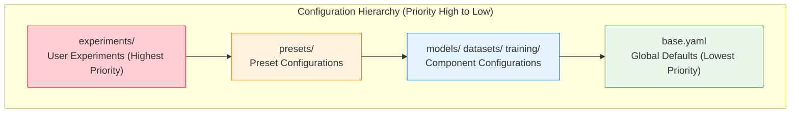

# Configuration System

> **Version**: 0.2
> **Updated**: 2026-03-26
> **Module**: `vlm2emb.config`
> **Dependency**: OmegaConf

BToks uses YAML configuration system based on OmegaConf, supporting inheritance, interpolation, and validation.

---

## Table of Contents

1. [Design Principles](#1-design-principles)
2. [Configuration Structure Specification](#2-configuration-structure-specification)
3. [Configuration Keyword Specification](#3-configuration-keyword-specification)
4. [Quick Start](#4-quick-start)
5. [Configuration Loading API](#5-configuration-loading-api)
6. [Configuration Inheritance](#6-configuration-inheritance)
7. [Variable Interpolation](#7-variable-interpolation)
8. [CLI Overrides](#8-cli-overrides)
9. [Configuration File Organization](#9-configuration-file-organization)
10. [Exception Handling](#10-exception-handling)
11. [Best Practices](#11-best-practices)
12. [Related Documents](#12-related-documents)

---

## 1. Design Principles

### 1.1 Core Philosophy

| Principle | Description |
|-----------|-------------|
| **YAML First** | All configurations defined via YAML files, no hardcoded parameters in code |
| **Inheritance Over Copying** | Reuse configurations via `_inherit_` directive |
| **Validation First** | Validate structure at load time, catch errors early |
| **Type Safety** | Use OmegaConf DictConfig, support type checking |

---

## 2. Configuration Structure Specification

### 2.1 Top-Level Keys

BToks configuration uses **4 top-level keys** to organize the configuration structure:

| Top-Level Key | Semantics | Consumed by train() | Consumed by evaluate() |
|---------------|-----------|---------------------|----------------------|
| **model** | Model architecture definition | ✓ | ✓ (when no runtime checkpoint is provided) |
| **peft** | PEFT training strategy | ✓ | ✗ (ignored) |
| **train** | Training-specific configuration | ✓ | ✗ (ignored) |
| **eval** | Evaluation configuration | ✓ (during training evaluation) | ✓ (standalone evaluation) |

### 2.2 Configuration Templates

**Training-Only Configuration**:
```yaml
# configs/presets/vlm2vec_qwen2vl_2b.yaml
model:
  _inherit_: ../models/vlm2vec.yaml

peft:
  _inherit_: ../peft/lora_default.yaml

train:
  dataset:
    type: combined
    datasets:
      _inherit_: ../datasets/mmeb_train.yaml

  collator:
    type: training

  trainer:
    type: vlm2vec_trainer

  args:
    _inherit_: ../training/vlm2vec_base.yaml
    output_dir: ./outputs/vlm2vec_baseline
    run_name: vlm2vec_baseline
```

**Evaluation-Only Configuration (runtime checkpoint)**:
```yaml
# configs/experiments/eval_mmeb.yaml
eval:
  _inherit_: ../eval/mmeb.yaml
  batch_size: 8
```

Provide the checkpoint at runtime:

```bash
python scripts/eval.py configs/experiments/eval_mmeb.yaml \
  --checkpoint ./outputs/vlm2vec_lora/checkpoint-5000
```

**Evaluation-Only Configuration (full model)**:
```yaml
# configs/experiments/eval_full_model.yaml
model:
  _inherit_: ../models/vlm2vec.yaml

eval:
  type: mmeb
  path: ~/datasets/MMEB-V2
  batch_size: 4
```

**Full Configuration (Training + Evaluation)**:
```yaml
# configs/presets/vlm2vec_with_eval.yaml
model:
  _inherit_: ../models/vlm2vec.yaml

peft:
  _inherit_: ../peft/lora_default.yaml

train:
  dataset:
    type: combined
    datasets:
      _inherit_: ../datasets/mmeb_train.yaml

  collator:
    type: training

  trainer:
    type: vlm2vec_trainer

  args:
    _inherit_: ../training/vlm2vec_base.yaml
    output_dir: ./outputs/vlm2vec_with_eval
    do_eval: true
    eval_strategy: steps
    eval_steps: 500

eval:
  type: mmeb
  path: ~/datasets/MMEB-V2
  batch_size: 4
```

### 2.3 Key Resolution Priority

1. **checkpoint is a runtime argument**: standalone evaluation receives the checkpoint via `scripts/eval.py --checkpoint ...`; it is not part of config semantics
2. **train is used only for training**: `evaluate()` completely ignores all configurations under `train`
3. **eval is shared between training and evaluation**:
   - During training: used for `Trainer.evaluate()` intermediate evaluation
   - During evaluation: used for standalone evaluation flow

---

## 3. Configuration Keyword Specification

### 3.1 Path Keyword Unification

| Old Keyword | New Keyword | Description |
|-------------|-------------|-------------|
| `data_path` | `path` | Evaluation dataset path |
| `processor_name_or_path` | (removed) | Automatically inferred from model configuration |

### 3.2 Type Keywords

Use `type` field to specify concrete implementation classes in configuration:

```yaml
train:
  dataset:
    type: combined          # Dataset type

  collator:
    type: training          # Collator type

  trainer:
    type: vlm2vec_trainer   # Trainer type

  args:
    type: vlm2vec           # TrainingArgs type
```

Training dataset composition now uses `combined`. Multi-dataset weights, names, and child dataset configs are written directly in the training config instead of being loaded through the old recipe artifact layer.

### 3.3 _inherit_ Keyword

`_inherit_` is used for configuration inheritance, supporting the following scenarios:

```yaml
# Top-level inheritance
_inherit_: ../base.yaml

# Nested inheritance
model:
  _inherit_: ../models/vlm2vec.yaml

train:
  dataset:
    datasets:
      _inherit_: ../datasets/mmeb_train.yaml
```

### 3.4 System Keywords

System-reserved keywords, cannot be used as user configuration keys:

| Keyword | Usage |
|---------|-------|
| `_inherit_` | Configuration inheritance |
| `_type_` | OmegaConf type marker |
| `_args_` | OmegaConf arguments marker |

---

## 4. Quick Start

### 4.1 Load Configuration

```python
from vlm2emb.config import load_config

# Load configuration file (supports inheritance and interpolation)
config = load_config("configs/experiments/vlm2vec.yaml")

# Access configuration values
print(config.model.type)                    # "vlm2emb"
print(config.train.args.learning_rate)      # 1e-5
```

### 4.2 Create Model

```python
from vlm2emb import create_model
from vlm2emb.config import load_config

config = load_config("configs/experiments/vlm2vec.yaml")
model = create_model(config.model)
```

### 4.3 Apply CLI Overrides

```python
from vlm2emb.config import load_config, apply_overrides

config = load_config("configs/experiments/vlm2vec.yaml")

# Apply command line overrides
config = apply_overrides(config, [
    "train.args.learning_rate=2e-5",
    "train.args.num_train_epochs=5",
])
```

> **Note**
> - `checkpoint` is not a valid configuration key; standalone eval only accepts it via `--checkpoint`
> - Even if `overrides` contains `checkpoint=...`, the current eval flow will not read or use it

---

## 5. Configuration Loading API

### 5.1 load_config

Main configuration loading function, supports inheritance and interpolation.

```python
def load_config(config_path: str | Path) -> Config:
    """Load a single configuration file with inheritance support.

    Args:
        config_path: YAML configuration file path

    Returns:
        DictConfig with inheritance applied and interpolations resolved

    Raises:
        ConfigNotFoundError: File does not exist
        ConfigSyntaxError: Invalid YAML syntax
        ConfigInheritanceError: Circular inheritance
        ConfigInterpolationError: Interpolation resolution failed
    """
```

**Examples**:

```python
from vlm2emb.config import load_config

# Basic usage
config = load_config("configs/experiments/vlm2vec.yaml")

# Relative path (relative to current working directory)
config = load_config("./my_config.yaml")

# Absolute path
config = load_config("/path/to/config.yaml")
```

### 5.2 apply_overrides

Apply CLI-style configuration overrides.

```python
def apply_overrides(config: Config, overrides: list[str]) -> Config:
    """Apply CLI overrides to configuration.

    Args:
        config: Loaded configuration DictConfig
        overrides: List of override strings in dotlist format

    Returns:
        Configuration with overrides applied
    """
```

**Supported Syntax**:

| Syntax | Description | Example |
|--------|-------------|---------|
| `key=value` | Set value | `learning_rate=1e-4` |
| `key.nested=value` | Nested key | `model.backbone.type=Qwen2VL` |
| `key=null` | Delete key | `debug.profiler=null` |
| `+key=value` | Add new key | `+experiment.tag=test` |
| `~key` | Delete key | `~debug` |

### 5.3 to_native_config

`load_config()` stops at OmegaConf containers; before entering most runtime entrypoints, convert the config to `dict` / `list` with `to_native_config()` or an equivalent native-container boundary.

```python
from vlm2emb.config import load_config, to_native_config

config = load_config("configs/presets/vlm2vec_qwen2vl_2b.yaml")
native_config = to_native_config(config, resolve=True)
```

Recommended boundary:

1. `vlm2emb.config` owns `_inherit_`, relative-path resolution, interpolation, and exception wrapping
2. runtime modules such as `dataset` / `trainer` / `model` consume native `dict` / `list`
3. if an entrypoint still needs OmegaConf semantics, document that explicitly instead of implicitly leaking OmegaConf downstream

**Examples**:

```python
from vlm2emb.config import load_config, apply_overrides

config = load_config("config.yaml")
config = apply_overrides(config, [
    "train.args.learning_rate=1e-4",
    "model.modules.0.dtype=float16",
    "+experiment.custom_tag=my_experiment",
])
```

---

## 6. Configuration Inheritance

### 6.1 Basic Inheritance

Use `_inherit_` directive to inherit other configuration files:

```yaml
# configs/experiments/my_experiment.yaml
_inherit_: ../base.yaml

# Override specific fields
experiment:
  name: "my_experiment"

train:
  args:
    learning_rate: 2e-5
```

**Inheritance Rules**:
1. `_inherit_` paths are resolved relative to **current configuration file directory**
2. Child configuration values **override** parent configuration fields with same names
3. Non-overridden fields retain parent configuration values

### 6.2 Nested Inheritance

Inheritance can be used at **any level** of configuration:

```yaml
# configs/experiments/vlm2vec.yaml
model:
  _inherit_: ../models/vlm2vec.yaml
  # Override model configuration
  normalize_embeddings: false

train:
  dataset:
    datasets:
      _inherit_: ../datasets/mmeb_train.yaml
```

Root-level `_inherit_` and subtree `_inherit_` may appear in the same file. The loader first merges the root inheritance, then recursively resolves nested `_inherit_` nodes in the merged result:

```yaml
_inherit_: ../base.yaml

train:
  args:
    _inherit_: ../training/vlm2vec_base.yaml
    learning_rate: 2e-5
```

### 6.3 Inheritance Chain

Configurations can form inheritance chains:

```
experiment.yaml → base.yaml → defaults.yaml
       │              │              │
       └─ override ─► └─ override ─► defaults
```

**Example**:

```yaml
# configs/defaults.yaml
train:
  args:
    epochs: 10
    batch_size: 32
    learning_rate: 1e-4

# configs/base.yaml
_inherit_: defaults.yaml
train:
  args:
    batch_size: 64  # Override

# configs/experiment.yaml
_inherit_: base.yaml
train:
  args:
    learning_rate: 2e-5  # Override
```

**Final Result**:
```yaml
train:
  args:
    epochs: 10          # From defaults.yaml
    batch_size: 64      # From base.yaml
    learning_rate: 2e-5 # From experiment.yaml
```

### 6.4 Circular Dependency Detection

Configuration system automatically detects and reports circular inheritance:

```yaml
# a.yaml
_inherit_: b.yaml

# b.yaml
_inherit_: a.yaml  # Error! Circular dependency
```

**Error Message**:
```
ConfigInheritanceError: Circular inheritance detected
  Inheritance chain: a.yaml → b.yaml → a.yaml
```

---

## 7. Variable Interpolation

### 7.1 Basic Interpolation

Use `${path.to.value}` to reference other configuration values:

```yaml
experiment:
  name: "vlm2vec_baseline"

output_dir: "./outputs/${experiment.name}"
# Resolves to: "./outputs/vlm2vec_baseline"

logging:
  wandb:
    name: "${experiment.name}"
    tags: "${experiment.tags}"
```

### 7.2 Environment Variables

Use `${oc.env:VAR}` or `${oc.env:VAR,default}` to reference environment variables:

```yaml
data:
  data_root: "${oc.env:DATA_ROOT,./data}"
  # If DATA_ROOT environment variable exists, use it
  # Otherwise use default ./data

environment:
  hf_home: "${oc.env:HF_HOME,./cache/huggingface}"
  cuda_devices: "${oc.env:CUDA_VISIBLE_DEVICES}"
```

### 7.3 Nested Interpolation

Interpolation can be nested:

```yaml
experiment:
  name: "vlm2vec"
  version: "v1"

output_dir: "./outputs/${experiment.name}_${experiment.version}"
# Resolves to: "./outputs/vlm2vec_v1"

logging_dir: "${output_dir}/logs"
# Resolves to: "./outputs/vlm2vec_v1/logs"
```

### 7.4 Interpolation Resolution Timing

Interpolations are automatically resolved when `load_config()` returns. For delayed resolution:

```python
from vlm2emb.config import ConfigLoader

loader = ConfigLoader()
# resolve_interpolation=False keeps interpolations unresolved
config = loader.load_with_inheritance("config.yaml", resolve_interpolation=False)

# Manual resolution
from vlm2emb.config import resolve_interpolations
config = resolve_interpolations(config)
```

---

## 8. CLI Overrides

### 8.1 Using in Scripts

```python
import argparse
from vlm2emb.config import load_config, apply_overrides

parser = argparse.ArgumentParser()
parser.add_argument("config", help="Config file path")
parser.add_argument("overrides", nargs="*", help="Config overrides")
args = parser.parse_args()

config = load_config(args.config)
config = apply_overrides(config, args.overrides)
```

**Command Line Usage**:

```bash
python scripts/train.py configs/presets/vlm2vec_qwen2vl_2b.yaml \
    train.args.learning_rate=2e-5 \
    train.args.num_train_epochs=10 \
    +experiment.custom_tag=ablation_lr
```

### 8.2 Overriding Arrays and Dictionaries

```bash
# Override array elements
python scripts/train.py configs/presets/vlm2vec_qwen2vl_2b.yaml \
    "model.modules.0.dtype=float16"

# Override entire array
python scripts/train.py configs/presets/vlm2vec_qwen2vl_2b.yaml \
    "experiment.tags=[train,vlm2vec,qwen2vl]"

# Override dictionary
python scripts/train.py configs/presets/vlm2vec_qwen2vl_2b.yaml \
    "peft.lora={r:32,alpha:64}"
```

---

## 9. Configuration File Organization

### 9.1 Recommended Directory Structure

```
configs/
├── models/                      # Model configurations (model._inherit_)
│   ├── vlm2vec.yaml            # VLM2Vec default model (Qwen2-VL-2B)
│   ├── vlm2vec_qwen2vl_2b.yaml
│   ├── vlm2vec_qwen3vl_2b.yaml
│   ├── btoks_qwen2vl_2b_v1.yaml
│   └── btoks_qwen2vl_2b_v2.yaml
│
├── peft/                        # PEFT configurations (peft._inherit_)
│   └── lora_default.yaml       # Default LoRA configuration
│
├── datasets/                    # Dataset configurations (train.dataset.datasets._inherit_)
│   ├── mmeb_train.yaml         # MMEB base layer
│   ├── btoks_mmeb_train.yaml   # BToks metadata.ntp_side semantic layer
│   ├── mmeb_train_optimized.yaml
│   ├── btoks_mmeb_train_optimized.yaml
│   ├── expanded_train_datasets_v1.yaml
│   └── btoks_expanded_train_datasets_v1.yaml
│
├── training/                    # Training args baselines (train.args._inherit_)
│   ├── vlm2vec_base.yaml       # VLM2Vec training args
│   └── btoks_base.yaml         # BToks training args
│
├── eval/                        # Evaluation config fragments (eval._inherit_, subtree fragments only)
│   ├── mmeb.yaml               # MMEB benchmark fragment
│   └── mmeb_migrated.yaml      # MMEB migrated fragment (with num_frames)
│
├── accelerate/                  # Accelerate configurations (independent system)
│   ├── 1_gpu.yaml
│   ├── 2_gpu.yaml
│   ├── 4_gpu.yaml
│   └── 8_gpu.yaml
│
├── presets/                     # Preset configurations (ready-to-use full training configs)
│   ├── vlm2vec.yaml            # VLM2Vec default preset
│   ├── vlm2vec_qwen2vl_2b.yaml
│   ├── vlm2vec_qwen2vl_2b_expanded_train_v1.yaml
│   ├── vlm2vec_qwen3vl_2b.yaml
│   ├── vlm2vec_with_eval.yaml  # Preset with in-training evaluation
│   ├── btoks_qwen2vl_2b_v1.yaml
│   ├── btoks_qwen2vl_2b_v2.yaml
│   └── btoks_qwen2vl_2b_v1_expanded_train_v1.yaml
│
└── experiments/                 # User experiment configurations
    ├── vlm2vec.yaml            # Local debugging experiment
    └── eval_mmeb_migrated.yaml # Evaluation entry (adapter + eval)
```

### 9.2 Configuration Hierarchy



### 9.3 Four-Layer Dataset Organization

`configs/datasets/` now follows four explicit layers:

1. `mmeb_train.yaml`: single source of truth for shared fields such as `type`, `path`, `subset`, and `transform`
2. `btoks_mmeb_train.yaml`: `_inherit_: ./mmeb_train.yaml` plus only `metadata.ntp_side`
3. `mmeb_train_optimized.yaml`: `_inherit_: ./mmeb_train.yaml` plus only `weight` overrides
4. `btoks_mmeb_train_optimized.yaml`: `_inherit_: ./btoks_mmeb_train.yaml` plus only `weight` overrides

The expanded training configs follow the same rule: `expanded_train_datasets_v1.yaml` owns the full expanded mixture, while `btoks_expanded_train_datasets_v1.yaml` only inherits it and adds `metadata.ntp_side`; it does not copy paths, splits, transforms, or weights.

Typical shape:

```yaml
# configs/datasets/btoks_mmeb_train.yaml
_inherit_: ./mmeb_train.yaml

VisDial:
  metadata:
    ntp_side: query
```

```yaml
# configs/datasets/mmeb_train_optimized.yaml
_inherit_: ./mmeb_train.yaml

ImageNet_1K:
  weight: 3
```

```yaml
# configs/datasets/btoks_mmeb_train_optimized.yaml
_inherit_: ./btoks_mmeb_train.yaml

ImageNet_1K:
  weight: 3
```

Constraints:

- `metadata.ntp_side` lives only in BToks layers, not in the shared base layer
- optimized layers override only `weight`
- local overrides can be written directly under the target dataset node without copying the whole YAML file
- `examples/datasets/optimize_weights.py` should target `configs/datasets/mmeb_train_optimized.yaml` and print `_inherit_ + weight overrides`

### 9.4 BToks Generation Protocol Arguments

`configs/training/btoks_base.yaml` now includes explicit generation-protocol arguments so BToks generation loss matches later cache generation:

| Argument | Default | Description |
|----------|---------|-------------|
| `generation_prefix_text` | `"<|im_start|>assistant\n"` | Protocol prefix inserted before each generation target |
| `generation_suffix_text` | `"<|im_end|>"` | Protocol suffix appended after each generation target |
| `include_generation_suffix_in_loss` | `true` | Whether generation loss should supervise the appended end-boundary token(s) |
| `generation_kv_mode` | `"compressed"` | KV cache mode for generation loss, either `"compressed"` or `"full"` |

Notes:

- the prefix header itself is always masked out of generation loss
- when `include_generation_suffix_in_loss` is disabled, `<|im_end|>` is still appended but excluded from supervision
- when `generation_kv_mode="compressed"`, generation uses btoks token KV when btoks tokens exist, and last-valid-token KV when `num_tokens=0`
- when `generation_kv_mode="full"`, generation loss uses the full encoder KV cache
- these arguments only affect the BToks generation auxiliary branch; they do not change the main embedding-path input protocol

### 9.5 Typical Experiment Configuration

```yaml
# configs/experiments/vlm2vec.yaml

# ==================== Inherit Model Configuration ====================
model:
  _inherit_: ../models/vlm2vec.yaml

# ==================== PEFT Configuration ====================
peft:
  _inherit_: ../peft/lora_default.yaml
  alpha: 64
  dropout: 0.1

# ==================== Training Configuration ====================
train:
  dataset:
    type: batch_interleave
    batch_size: 64
    datasets:
      _inherit_: ../datasets/mmeb_train.yaml

  collator:
    type: training

  trainer:
    type: vlm2vec_trainer

  args:
    _inherit_: ../training/vlm2vec_base.yaml
    output_dir: ./outputs/vlm2vec
    gc_q_chunk_size: 4
    gc_p_chunk_size: 4
    per_device_train_batch_size: 32
    learning_rate: 1.0e-5
    max_steps: 10
```

### 9.6 Known Deviations

When migrating from the old configuration structure to the new one, the following are known differences:

| Old Configuration | New Configuration | Description |
|-------------------|-------------------|-------------|
| `train.args.learning_rate` | `train.args.learning_rate` | Training args moved to `train.args` |
| `data.train.dataset` | `train.dataset` | Data config integrated under `train` |
| `data.train.collator` | `train.collator` | Collator config moved to `train` |
| `trainer:` (top-level) | `train.trainer:` | Trainer moved under `train` |
| `config["benchmark"]` | `config.eval` | Evaluation config unified as `eval` key |
| `processor_name_or_path` | (removed) | Automatically inferred from model config |
| `data_path` | `path` | Evaluation dataset path unified as `path` |
| `adapter_path` (within model) | `adapter.path` (top-level) | Adapter path promoted to top-level |

**Migration Example**:

Old configuration:
```yaml
model:
  type: vlm2emb
  adapter_path: ./outputs/lora

training_args:
  learning_rate: 1e-5

data:
  train:
    dataset:
      type: batch_interleave
```

New configuration:
```yaml
model:
  type: vlm2emb

adapter:
  path: ./outputs/lora

train:
  args:
    learning_rate: 1e-5

  dataset:
    type: batch_interleave
```

---

## 10. Exception Handling

### 10.1 Exception Hierarchy

```
ConfigError (Base)
├── ConfigNotFoundError      # File does not exist
├── ConfigSyntaxError        # YAML syntax error
├── ConfigInheritanceError   # Inheritance error (circular, invalid path)
├── ConfigValidationError    # Validation failed
└── ConfigInterpolationError # Interpolation resolution failed
```

### 10.2 Exception Handling Examples

```python
from vlm2emb.config import load_config
from vlm2emb.exceptions import (
    ConfigError,
    ConfigNotFoundError,
    ConfigSyntaxError,
    ConfigInheritanceError,
    ConfigInterpolationError,
)

try:
    config = load_config("config.yaml")
except ConfigNotFoundError as e:
    print(f"Configuration file not found: {e.attempted_path}")
except ConfigSyntaxError as e:
    print(f"YAML syntax error: {e.file_path}")
    print(f"  Line number: {e.line_number}")
    print(f"  Suggestion: {e.suggestion}")
except ConfigInheritanceError as e:
    print(f"Inheritance error: {e.error_type}")
    print(f"  Inheritance chain: {' → '.join(e.inheritance_chain)}")
except ConfigInterpolationError as e:
    print(f"Interpolation resolution failed: {e.unresolved_reference}")
except ConfigError as e:
    print(f"Configuration error: {e}")
```

### 10.3 Common Errors and Solutions

| Error | Cause | Solution |
|-------|-------|----------|
| `ConfigNotFoundError` | File path error | Check path correctness, pay attention to working directory when using relative paths |
| `ConfigSyntaxError` | YAML indentation error | Check YAML indentation (use spaces, not tabs) |
| `ConfigInheritanceError: circular` | Circular inheritance | Check inheritance chain, remove circular dependencies |
| `ConfigInterpolationError` | Referenced key does not exist | Ensure `${...}` referenced keys exist |

---

## 11. Best Practices

### 11.1 Configuration Organization

1. **Use Inheritance to Reduce Duplication**
   ```yaml
   # Good ✅
   _inherit_: ../base.yaml
   train:
     args:
       learning_rate: 2e-5

   # Bad ❌ - Copy all defaults
   train:
     args:
       epochs: 10
       batch_size: 32
       learning_rate: 2e-5
       # ... more duplication
   ```

2. **Use Interpolation for Consistency**
   ```yaml
   # Good ✅
   experiment:
     name: "vlm2vec_ablation"
   output_dir: "./outputs/${experiment.name}"
   logging_dir: "${output_dir}/logs"

   # Bad ❌ - Hardcoded duplicate values
   output_dir: "./outputs/vlm2vec_ablation"
   logging_dir: "./outputs/vlm2vec_ablation/logs"
   ```

3. **Reasonable Configuration Granularity**
   ```yaml
   # Good ✅ - Logical grouping
   model:
     type: vlm2emb
     modules: [...]

   train:
     args:
       learning_rate: 1e-5
       batch_size: 32

   # Bad ❌ - Flattened
   model_type: vlm2emb
   model_modules: [...]
   learning_rate: 1e-5
   batch_size: 32
   ```

### 11.2 Naming Conventions

| Type | Naming Convention | Example |
|------|-------------------|---------|
| Configuration file | snake_case.yaml | `vlm2vec_baseline.yaml` |
| Configuration key | snake_case | `learning_rate`, `batch_size` |
| Experiment name | snake_case | `vlm2vec_ablation_lr` |
| Boolean | is_/has_/enable_ prefix | `enabled`, `use_grad_cache` |

### 11.3 Debugging Configuration

```python
from omegaconf import OmegaConf
from vlm2emb.config import load_config

config = load_config("config.yaml")

# Print full configuration
print(OmegaConf.to_yaml(config))

# Check specific value
print(config.model.type)

# Check if key exists
if "peft" in config:
    print(config.peft)

# Convert to regular dict
config_dict = OmegaConf.to_container(config, resolve=True)
```

---

## 12. Related Documents

- [Architecture Overview](./overview.md) - Overall architecture design
- [BToks API](../api/model.md) - create_model usage with configuration
- [OmegaConf Documentation](https://omegaconf.readthedocs.io/) - Official documentation
