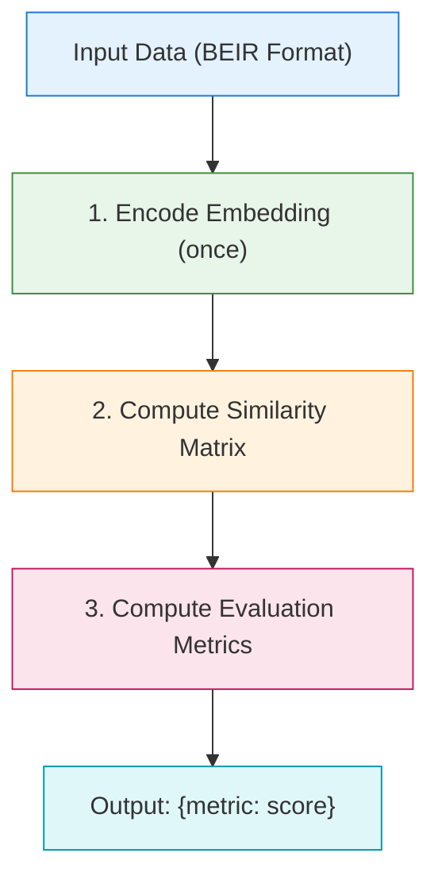

# Evaluation System Design

> **Version**: 0.1
> **Updated**: 2026-03-26
> **Architecture Design Version**: 1.0
> **Reference**: sentence-transformers evaluation framework

---

## 1. Design Philosophy

### 1.1 Framework Approach

Adopts **Lightweight Functions + Registry** approach (Option B):

| Aspect | Description |
|--------|-------------|
| **Core Evaluation Functions** | Direct call, no complex inheritance |
| **Configurable Evaluator** | `Evaluator` class manages evaluation workflow |
| **Registry Integration** | Naturally reuse existing registry system |
| **Trainer Integration** | Evaluation during/after training |

### 1.2 Evaluation Flow



---

## 2. Data Format

### 2.1 BEIR Extended Format

```python
data = {
    # Queries (each query is dict, contains arbitrary parameters)
    "queries": {
        "q1": {"text": "query text"},           # Pure text query
        "q2": {"text": "query text", "image": pil_image},  # Text + image
        "q3": {"image": pil_image},             # Image only
        # Any parameters the model needs...
    },
    # Candidate documents
    "corpus": {
        "c1": {"text": "document text"},
        "c2": {"text": "document text", "image": pil_image},
        # ...
    },
    # Binary relevance (standard BEIR format)
    "relevant_docs": {
        "q1": ["c1", "c5"],
        "q2": ["c3"],
    },
    # Graded relevance (extended format, optional)
    "relevance_scores": {
        "q1": {"c1": 3, "c5": 2},  # Relevance with scores
        "q2": {"c3": 1},
    },
}
```

**Notes**:
- `relevant_docs`: Standard BEIR binary format, relevance is 0/1
- `relevance_scores`: Optional, relevance with scores (1, 2, 3... higher means more relevant)

### 2.2 Data Format Comparison

| Format | Use Case | Supported NDCG Form |
|--------|----------|---------------------|
| `relevant_docs` (binary) | Most datasets (MMEB, ViDoRe, etc.) | Linear |
| `relevance_scores` (graded) | Evaluation sets with relevance scores | Linear / Exponential |

---


### 2.3 MMEB Lance Conversion Maintenance Decisions (2026-02-06)

The following constraints are based on raw MMEB `test-*.parquet` inspection and local Lance write validation:

1. In `qrels.lance`, relevance is stored as two parallel list columns: `candidate_ids: list<string>` and `candidate_scores: list<float32>`.
2. Conversion scripts must call `expanduser()` for `--image-root` so `~` paths do not silently break image loading.
4. Query-side token/image consistency check across 36,000 MMEB image-task queries:
   - `text contains image token but no image`: only `WebQA`/`EDIS` (2,000 rows)
   - `has image but text has no image token`: 0 rows
5. For text-only queries (e.g., T2I queries), remove legacy image tokens (`<|image_1|>`, `<|image_pad|>`, `<image>`) to keep semantics aligned with actual inputs.
6. For I2I/VG candidates, keep no trailing newline for image-only entries, and keep trailing newline when caption text exists (to match v1 parser behavior).


### 2.4 Eval Conversion vs Original Parser: Mismatch Log (2026-02-07)

Scope note: this section records only observed mismatches between original parser behavior and conversion scripts, plus the current rationale (including necessary inference). Decision workflow is handled in conversation, not as doc TODOs.

1. **Trailing-newline policy (now parser-aligned)**
   - Current status: newline behavior is aligned with explicit logic in parsers under the public MMEB parser implementation (e.g., `image_*` parsers append `\n`, while `vidore/visrag` parsers do not append trailing newlines).
   - Current rationale: we append newlines only when the parser explicitly does so; no parser-side misuse of literal `\n` (as plain text) has been found.
2. **Path convention mismatch (case/hierarchy)**
   - Mismatch: video/visdoc converters now resolve paths from explicit path/alias tables only, without automatic variant guessing; undeclared local variants fail fast.
   - Current rationale: this keeps behavior deterministic and auditable, avoiding silent path drift.
3. **Video frame sampling mismatch (approved exception)**
   - Mismatch: original video parsers often use `process_video_frames(..., num_frames=...)` for frame sampling, while current converters keep all frames and do not apply `num_frames` sampling.
   - Current rationale: this is an approved exception to preserve full-frame evaluation inputs.
4. **Legacy-token cleanup for no-media queries (approved exception)**
   - Mismatch: in original `image_t2i_eval.py`, `<|image_1|>` is replaced with a model image token; current converters remove legacy tokens (`<|image_1|>`, `<|image_pad|>`, `<image>`) when a query is confirmed to have no image input.
   - Current rationale: this applies only to no-media query paths to avoid token/input mismatch; all other paths stay parser-aligned.


## 3. Evaluation Metrics

### 3.1 Supported Metrics

| Metric | Function Name | Description |
|--------|---------------|-------------|
| MRR@K | `mrr_at_k` | Mean Reciprocal Rank |
| NDCG@K | `ndcg_at_k` | Normalized Discounted Cumulative Gain |
| MAP@K | `map_at_k` | Mean Average Precision |
| Hit@K | `hit_at_k` | Hit indicator |

### 3.2 Two Forms of NDCG

```python
# Linear form (standard form, relevance decays linearly)
ndcg_at_k(scores, relevance, k, form="linear")

# Exponential form (high relevance more important, exponential amplification)
ndcg_at_k(scores, relevance, k, form="exponential")
```

**Formula Comparison**:

| Form | Formula | Use Case |
|------|---------|----------|
| Linear | $rel_i / \log_2(i+1)$ | Standard scenarios |
| Exponential | $2^{rel_i} - 1 / \log_2(i+1)$ | High relevance documents more important |

### 3.3 Core Evaluation Functions

```python
def hit_at_k(
    query_embeds: Tensor,           # (N_q, D)
    candidate_embeds: Tensor,       # (N_c, D)
    positive_labels: list[list[int]],
    k: int = 1,
) -> float:
    """Calculate Hit@K.

    Args:
        query_embeds: Query embeddings (N_q, D)
        candidate_embeds: Candidate embeddings (N_c, D)
        positive_labels: List of positive indices for each query
        k: Top-K threshold

    Returns:
        Hit@K score
    """


def mrr_at_k(
    query_embeds: Tensor,
    candidate_embeds: Tensor,
    positive_labels: list[list[int]],
    k: int = 10,
) -> float:
    """Calculate MRR@K (Mean Reciprocal Rank).

    Reciprocal rank of the first relevant document.
    """


def ndcg_at_k(
    query_embeds: Tensor,
    candidate_embeds: Tensor,
    relevance: dict | list[list[int]],
    k: int = 10,
    form: str = "linear",
) -> float:
    """Calculate NDCG@K (Normalized Discounted Cumulative Gain).

    Args:
        relevance: Relevance labels
            - dict: graded relevance, {qid: {cid: score, ...}}
            - list: binary relevance, same format as positive_labels
        form: "linear" or "exponential"
    """
```

---

## 4. Core Interfaces

### 4.1 Evaluation Entry Function

```python
from vlm2emb import evaluate

results = evaluate(
    config,
    checkpoint="/path/to/checkpoint",
    output_dir="/path/to/output",
    config_path="configs/presets/xxx.yaml",
)
```

The current `evaluate(...)` entry point is responsible for:

- resolving the runtime model source from the explicit `checkpoint` argument or `config["model"]`
- loading model / processor
- running the benchmark
- saving `results.json` and resolved `config.yaml` on the main process
- synchronizing and finalizing the evaluation runtime

Model source resolution supports two modes:

| Runtime source | Description |
|----------------|-------------|
| `checkpoint` argument | Preferred when provided; in PEFT mode the processor is initialized from `base_model` first |
| `config["model"]` | Used when no runtime checkpoint is provided |

### 4.1.1 MomentSeeker single-subset baseline

For a clean `MomentSeeker` baseline log, use the real `scripts/eval.py` CLI entry point together with `--log-file`, `eval.datasets=[MomentSeeker]`, `eval.show_progress=false`, and `--verbose`:

```bash
python scripts/eval.py configs/presets/vlm2vec_qwen2vl_2b.yaml \
    --checkpoint /path/to/checkpoint \
    --log-file output/momentseeker.log \
    --verbose \
    eval.data_path=/path/to/MMEB-V2 \
    eval.datasets=[MomentSeeker] \
    eval.show_progress=false \
    eval.num_workers=0
```

Notes:
- `--log-file` keeps the baseline output grep-friendly for later inspection.
- `eval.datasets=[MomentSeeker]` limits the run to the single subset that is being profiled.
- `eval.show_progress=false` avoids progress-bar noise.
- `--verbose` keeps the extra `retrieval_protocol` stage logs that help explain rank, gather, trim, and reorder behavior.
- Gathered query / candidate embeddings must be reordered back to the original global sample order before metrics are computed; any qrels / ids alignment drift is a correctness bug.

### 4.1.2 Distributed shard semantics

The runtime shards evaluation data in a block-cyclic pattern using the effective eval `batch_size` as the block size. Each rank therefore owns a truthful `shard_blocks` list instead of a single contiguous `shard=[start, stop)` interval. Detailed shard, gather, trim, and reorder state is available only in DEBUG logs through the `retrieval_protocol` records.

After gather, the main process reorders both query and candidate embeddings back to the original global order using the gathered sample indices. This qrels / ids alignment is a correctness boundary, not a best-effort optimization: if the reordered tensors drift from the original global order, metric computation is invalid.

For `MomentSeeker`, query-side cost and candidate-side cost should still be considered separately: the query side mixes text, image, and video conditions, while candidates are always video clips.

### 4.2 RetrievalEvalDataset, EvalLanceDataset, and LanceDataset

The public retrieval-eval container remains:

```python
from vlm2emb.data.datasets.eval import RetrievalEvalDataset

dataset = RetrievalEvalDataset(...)
```

For `MMEB-V2 eval`, the maintained builder is:

```python
from vlm2emb.data.datasets.mmeb_v2 import build_mmeb_eval_dataset

dataset = build_mmeb_eval_dataset(
    dataset_name="MVBench",
    artifact_path="/path/to/MMEB-V2/video-tasks/MVBench",
    transform_kwargs={"runtime_mode": "canonical", "num_frames": 8},
)
```

Runtime responsibilities are split as follows:

- `queries` / `candidates`: `EvalLanceDataset` plus parser-owned transforms
- `qrels`: raw `LanceDataset`

Notes:
- `VideoEvalLanceDataset` still exists as a compatibility wrapper in `base.py`
- `MMEB-V2 eval` no longer uses `VideoEvalLanceDataset` as its mainline runtime path; parser modules under `src/vlm2emb/data/datasets/mmeb_v2/` now own prompt/layout/text-transform behavior

The unified raw Lance wrapper now lives in:

```python
from vlm2emb.data.datasets.base import LanceDataset
```

`LanceDataset` is raw-only: exact column access, lazy Lance handle creation, and no decode/runtime-transform logic.

### 4.3 Batch Encoding Function

```python
def _encode_batch(
    model,
    processor,
    items: list[dict],
    batch_size: int = 32,
) -> Tensor:
    """Batch encoding.

    Each item is dict containing arbitrary parameters needed by the model.

    Args:
        items: [{text: "...", image: ...}, ...]
        batch_size: Batch size

    Returns:
        Embedding vectors (N, D)
    """
```

### 4.3 Similarity Computation

```python
def compute_scores(
    query_embeds: Tensor,
    candidate_embeds: Tensor,
    method: str = "cosine",
) -> Tensor:
    """Compute similarity matrix between queries and candidates.

    Args:
        query_embeds: (N_q, D)
        candidate_embeds: (N_c, D)
        method: "cosine" or "dot"

    Returns:
        Similarity matrix (N_q, N_c)
    """
```

---

## 5. Configurable Evaluator

### 5.1 EvalConfig

```python
@dataclass
class EvalConfig:
    """Evaluation configuration.

    Attributes:
        datasets: List of dataset configurations
        metrics: List of complete metric names (e.g., ["hit@1", "ndcg@5"])
        batch_size: Encoding batch size
        collator: Collator configuration (optional)
        strategy: Evaluation strategy ("steps" or "epoch")
        eval_steps: Evaluation step interval
        eval_on_start: Whether to evaluate at training start
        output_format: Output format ("table", "json", "both")
    """
    datasets: list[dict]
    metrics: list[str]
    batch_size: int = 32
    collator: dict | None = None
    strategy: str = "steps"
    eval_steps: int = 1000
    eval_on_start: bool = True
    output_format: str = "both"
```

Retrieval metrics use complete metric names in `<metric>@<k>` format. The old
split form `metrics=["hit", "ndcg"]` plus `k_values=(1, 5)` must be migrated to
`metrics=["hit@1", "hit@5", "ndcg@1", "ndcg@5"]`.

### 5.2 Evaluator Class

```python
class Evaluator:
    """Configurable evaluator.

    Manages evaluation workflow, supports multi-dataset, multi-metric evaluation.
    """

    def __init__(self, config: EvalConfig):
        """Initialize evaluator.

        Args:
            config: Evaluation configuration
        """
        self.config = config
        self._metric_fns: dict[str, Callable] = {}
        self._register_default_metrics()

    def _register_default_metrics(self):
        """Register default metric functions."""
        from vlm2emb.evaluation import metrics as metric_module

        default_metrics = {
            "hit@1": metric_module.hit_at_k,
            "hit@5": metric_module.hit_at_k,
            "hit@10": metric_module.hit_at_k,
            "mrr@10": metric_module.mrr_at_k,
            "ndcg@10": metric_module.ndcg_at_k,
            "map@10": metric_module.map_at_k,
        }

        for name, fn in default_metrics.items():
            self.register_metric(name, fn)

    def register_metric(self, name: str, fn: Callable):
        """Register metric function.

        Args:
            name: Metric name (e.g., "hit@1")
            fn: Metric function
        """
        self._metric_fns[name] = fn

    def evaluate_dataset(
        self,
        model,
        processor,
        dataset_config: dict,
    ) -> dict[str, float]:
        """Evaluate single dataset.

        Args:
            model: BToks model
            processor: Corresponding processor
            dataset_config: Dataset configuration

        Returns:
            {metric_name: score}
        """
        # 1. Load dataset
        data = self._load_dataset(dataset_config)

        # 2. Compute embedding
        q_emb = _encode_batch(model, processor, data["queries"], self.config.batch_size)
        c_emb = _encode_batch(model, processor, data["corpus"], self.config.batch_size)

        # 3. Compute similarity
        scores = compute_scores(q_emb, c_emb)

        # 4. Compute metrics
        relevance = data.get("relevance_scores", data["relevant_docs"])
        positive_labels = _build_labels(data["relevant_docs"], len(data["corpus"]))

        results = {}
        for metric_name in self.config.metrics:
            fn = self._metric_fns.get(metric_name)
            if fn:
                k = int(metric_name.split("@")[-1])
                if "ndcg" in metric_name:
                    results[metric_name] = fn(scores, relevance, k=k)
                else:
                    results[metric_name] = fn(scores, positive_labels, k=k)

        return results

    def evaluate_all(
        self,
        model,
        processor,
    ) -> dict[str, dict[str, float]]:
        """Evaluate all configured datasets.

        Args:
            model: BToks model
            processor: Corresponding processor

        Returns:
            {dataset_name: {metric_name: score, ...}}
        """
        results = {}
        for ds_config in self.config.datasets:
            ds_name = ds_config.get("name", ds_config.get("type", "unknown"))
            results[ds_name] = self.evaluate_dataset(model, processor, ds_config)
        return results

    def _load_dataset(self, config: dict) -> dict:
        """Load dataset (implemented by subclass or Registry load)."""
        ...

    def _build_labels(self, relevant_docs: dict, num_candidates: int) -> list[list[int]]:
        """Build positive_labels format."""
        labels = []
        for qid in relevant_docs:
            doc_ids = relevant_docs[qid]
            labels.append([self._get_doc_index(doc_id, num_candidates) for doc_id in doc_ids])
        return labels
```

### 5.3 Factory Function

```python
def create_evaluator(config: dict | EvalConfig) -> Evaluator:
    """Create evaluator from config.

    Args:
        config: Config dict or EvalConfig object

    Returns:
        Configured Evaluator instance

    Example:
        >>> config = {"datasets": [...], "metrics": ["hit@1", "mrr@10"]}
        >>> evaluator = create_evaluator(config)
    """
    if isinstance(config, dict):
        config = EvalConfig(**config)
    return Evaluator(config)
```

---

## 6. Configuration Files

### 6.1 Default Evaluation Configuration

```yaml
# configs/components/eval/default.yaml

# Default metric configuration
defaults:
  - metrics: default
  - collator: eval

# Dataset list (user configures)
datasets: []

# Default metrics
metrics:
  - hit@1
  - hit@10
  - mrr@10
  - ndcg@10

# Evaluation parameters
batch_size: 32
strategy: steps
eval_steps: 1000
eval_on_start: true
output_format: both
```

### 6.2 Default Metrics Configuration

```yaml
# configs/components/eval/metrics.yaml

# Default retrieval metrics
default:
  - hit@1
  - hit@10
  - mrr@10
  - ndcg@10

# Full metrics
full:
  - hit@1
  - hit@5
  - hit@10
  - mrr@10
  - ndcg@10
  - map@10
  - hit@10
```

### 6.3 Usage in Experiment Configuration

```yaml
# configs/experiments/vlm2vec.yaml

# ==================== Evaluation ====================
eval:
  do_eval: true

  # Evaluation datasets
  datasets:
    - type: mmeb
      name: mmeb/science
      path: /path/to/mmeb/science
      split: test

    - type: mmeb
      name: mmeb/action
      path: /path/to/mmeb/action
      split: test

    - type: vidore
      name: vidore
      path: /path/to/vidore
      split: test

  # Evaluation metrics
  metrics:
    - hit@1
    - hit@5
    - hit@10
    - mrr@10
    - ndcg@10
    - map@10

  # Evaluation parameters
  batch_size: 32

  # Evaluation strategy
  eval_strategy: steps
  eval_steps: 1000
  eval_on_start: true

  # Output configuration
  output:
    format: both
    save_path: ./eval_results
```

---

## 7. Trainer Integration

### 7.1 Evaluation in Trainer

```python
# src/vlm2emb/training/trainers/vlm2vec_trainer.py

class VLM2VecTrainer(Trainer):
    """VLM2Vec trainer with configurable evaluation."""

    def __init__(
        self,
        eval_config: dict | EvalConfig | None = None,
        **kwargs,
    ):
        super().__init__(**kwargs)
        self.eval_config = None
        self.evaluator = None

        if eval_config:
            if isinstance(eval_config, dict):
                self.eval_config = EvalConfig(**eval_config)
            else:
                self.eval_config = eval_config
            self.evaluator = create_evaluator(self.eval_config)

    def evaluate(
        self,
        eval_dataset=None,
        ignore_keys=None,
        metric_key_prefix="eval",
    ):
        """Evaluation method (overridden to support configurable evaluation).

        If eval_config is configured, use configured evaluator;
        otherwise use default behavior.
        """
        if self.evaluator is None:
            return super().evaluate(eval_dataset, ignore_keys, metric_key_prefix)

        # Use configured evaluator
        results = self.evaluator.evaluate_all(self.model, self.processor)

        # Convert to Trainer format
        flat_results = {}
        for ds_name, ds_metrics in results.items():
            for metric, value in ds_metrics.items():
                flat_results[f"{metric_key_prefix}_{ds_name}_{metric}"] = value

        # Log results
        self._log_metrics(flat_results)

        return flat_results
```

### 7.2 Usage in Training

```python
# Training configuration
training_args = TrainingArguments(
    output_dir="./output",
    do_eval=True,           # Enable evaluation
    eval_strategy="steps",  # Evaluation strategy
    eval_steps=1000,        # Evaluation interval
)

# Create trainer (pass eval_config)
trainer = VLM2VecTrainer(
    model=model,
    args=training_args,
    train_dataset=train_dataset,
    eval_config={
        "datasets": [...],
        "metrics": ["hit@1", "hit@10", "mrr@10", "ndcg@10"],
        "eval_steps": 1000,
    },
)

# Train (evaluation will run automatically)
trainer.train()
```

---

## 8. Standalone Evaluation Script

```python
# scripts/eval.py

from vlm2emb.config import load_config
from vlm2emb import create_model, AutoProcessor
from vlm2emb.evaluation import create_evaluator


def main(config_path: str):
    """Standalone evaluation script entry point."""

    # Load configuration
    config = load_config(config_path)

    # Create model and processor
    model = create_model(config.model)
    processor = AutoProcessor.from_pretrained(
        config.model.modules[0].model_name_or_path
    )

    # Create evaluator
    evaluator = create_evaluator(config.eval)

    # Run evaluation
    print("Starting evaluation...")
    results = evaluator.evaluate_all(model, processor)

    # Output results
    print("\n" + "=" * 60)
    print("Evaluation Results")
    print("=" * 60)

    for ds_name, metrics in results.items():
        print(f"\n[{ds_name}]")
        for metric, value in metrics.items():
            print(f"  {metric}: {value:.4f}")

    print("=" * 60)

    return results


if __name__ == "__main__":
    import sys
    main(sys.argv[1])
```

**Usage**:

```bash
# Evaluate using configuration file
python scripts/eval.py configs/experiments/vlm2vec.yaml

# With WandB output
WANDB_MODE=online python scripts/eval.py configs/experiments/vlm2vec.yaml
```

---

## 9. File Structure

```
src/vlm2emb/
  evaluation/
    __init__.py              # Public API exports
    evaluate.py              # evaluate(config, checkpoint=...) entry point
    benchmarks/
      __init__.py
      base.py                # BaseBenchmark
      mmeb.py                # MMEBBenchmark
    evaluators/
      __init__.py
      base.py                # BaseEvaluator
      retrieval.py           # RetrievalEvaluator
    metrics.py               # Evaluation metric functions
```

> **Note**: The Chinese version of this document (`docs/zh/architecture/evaluation-system.md`) contains the most up-to-date architecture description including Lance-based datasets, Benchmark/Evaluator pattern, and distributed evaluation support. Key changes:
> - `evaluate(config, checkpoint=...)` is the unified entry point (exported from `vlm2emb`)
> - Runtime resources (model, processor_wrapper, accelerator) are passed to `__call__`, not constructors
> - `BaseBenchmark.__call__` signature: `(model, processor_wrapper, accelerator, **kwargs)`

---

## 10. Related Documents

- [Architecture Overview](./overview.md) - Overall architecture design
- [Module Pipeline System](./module-pipeline.md) - Model module design
- [Training System](./training-system.md) - Trainer design
- [API Reference](../api/model.md) - BToks API
