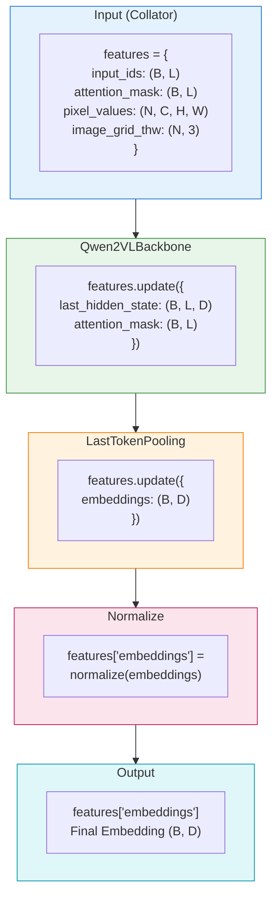

# Module Pipeline System

> **Version**: 0.1
> **Updated**: 2026-01-25
> **Architecture Design Version**: 1.0
> **Reference**: sentence-transformers module design

## 1. Design Philosophy

### 1.1 Benchmarking sentence-transformers

BToks's module pipeline design directly references [sentence-transformers](https://www.sbert.net/):

- **Module Composition**: Model consists of sequential modules
- **Unified Interface**: All modules implement `forward(features) -> features`
- **Features Dict**: Modules pass data through dictionary, supporting flexible extensions

### 1.2 Core Advantages

| Advantage | Description |
|-----------|-------------|
| **Flexible Composition** | Combine different modules via configuration, no code changes |
| **Easy Extension** | New modules only need to inherit base class and register |
| **Configuration-Driven** | Different methods switched via configuration |
| **Transparent Debugging** | Features dict can be inspected at any point |

---

## 2. Module Base Class

### 2.1 Module Interface

All pipeline modules implement unified interface:

```python
import torch.nn as nn
from torch import Tensor

class Module(nn.Module):
    """Module base class - all pipeline modules inherit from this.

    Module 基类 - 所有管道模块继承此类。
    """

    def forward(self, **features) -> dict[str, Tensor]:
        """Process features and return updated features dict.

        处理 features 并返回更新后的 features 字典。

        Args:
            **features: Input features dictionary
                       输入特征字典

        Returns:
            Updated features dict with new/modified keys
            更新后的特征字典，包含新增/修改的键
        """
        raise NotImplementedError

    @classmethod
    def from_config(cls, config: dict) -> "Module":
        """Create module from configuration dict.

        从配置字典创建模块。

        Args:
            config: Config dict with 'type' and module parameters
                   配置字典，包含 'type' 和模块参数

        Returns:
            Module instance
            模块实例
        """
        config = config.copy()
        config.pop("type", None)  # Remove type key
        return cls(**config)
```

**Design Principle**: All modules follow the same `forward(**features) -> dict` interface, no additional extension interfaces needed.

### 2.2 Processor Handling

BToks follows **HuggingFace Standard Pattern**, Model and Processor are completely separated:

```python
from vlm2emb import BToks
from transformers import AutoProcessor

# Model and Processor loaded separately
model = BToks.from_pretrained("/path/to/local/checkpoint")
processor = AutoProcessor.from_pretrained("/path/to/local/checkpoint")

# Use processor to preprocess inputs
inputs = processor(text=["Hello"], images=[image], return_tensors="pt")

# Forward pass
outputs = model(**inputs)
embeddings = outputs["embeddings"]
```

**Design Principles**:

| Aspect | Description |
|--------|-------------|
| **HF Compatible** | Fully follows HuggingFace Model/Processor separation pattern |
| **Separation of Concerns** | Model handles computation, Processor handles preprocessing |
| **Independent Save** | `model.save_pretrained()` and `processor.save_pretrained()` called separately |
| **Flexible Composition** | Processor can be replaced independently without affecting model |

**Save and Load**:

```python
# Save to same directory (HF standard pattern)
model.save_pretrained("./my_model")
processor.save_pretrained("./my_model")

# Directory structure:
# ./my_model/
# ├── config.json              # Model config
# ├── model.safetensors        # Model weights
# ├── preprocessor_config.json # Processor config
# ├── tokenizer_config.json    # Tokenizer config
# └── ...
```

---

## 3. Features Dict Standard Keys

Modules pass data through `features` dict. Standard keys defined below:

### 3.1 Input Layer Keys (Provided by Collator)

| Key | Shape | Description |
|-----|-------|-------------|
| `input_ids` | `(B, L)` | Token IDs |
| `attention_mask` | `(B, L)` | Attention mask, 1=valid, 0=padding |
| `pixel_values` | `(N, C, H, W)` | Image pixel values |
| `image_grid_thw` | `(N, 3)` | Image grid dimensions (Qwen2VL) |
| `pixel_values_videos` | `...` | Video pixel values |
| `video_grid_thw` | `...` | Video grid dimensions |

### 3.2 Intermediate Layer Keys (Output by Backbone)

| Key | Shape | Description |
|-----|-------|-------------|
| `last_hidden_state` | `(B, L, D)` | Transformer last layer output |
| `hidden_states` | `tuple` | All layer outputs (optional) |

### 3.3 Output Layer Keys (Output by Pooling/Normalize)

| Key | Shape | Description |
|-----|-------|-------------|
| `embeddings` | `(B, D)` | Pooled embedding vectors |

### 3.4 Data Flow Example



---

## 4. Built-in Modules Details

### 4.1 BackboneBase Base Class

All Backbone modules inherit from `BackboneBase(nn.Module)` abstract base class, used for type identification (e.g., PEFT `modules_to_save` inference skips Backbone).

```python
from vlm2emb.modules.backbone import BackboneBase

isinstance(backbone, BackboneBase)  # True
```

### 4.2 Qwen2VLBackbone

Qwen2-VL backbone module, wraps `Qwen2VLForConditionalGeneration`.

Supports dual-mode `from_config` initialization:

| Mode | Trigger | Behavior |
|------|---------|----------|
| **Load mode** | Config has `model_name_or_path` | Calls `from_pretrained` to load pretrained weights |
| **Structure mode** | Config has `backbone_config` | Creates model structure only, no weight loading (for `from_pretrained` scenarios) |

> **Note**:
>
> - Recipe config (training / fresh initialization) usually only provides `model_name_or_path`
> - Artifact config (`save_pretrained` output) keeps both in reference mode:
>   - `backbone_config` for skeleton construction
>   - `model_name_or_path` for a single reference reload

```python
from vlm2emb.modules import Qwen2VLBackbone

# Load mode: from pretrained (used during training)
backbone = Qwen2VLBackbone.from_config({
    "model_name_or_path": "Qwen/Qwen2-VL-7B-Instruct",
    "dtype": "bfloat16",
    "attn_implementation": "flash_attention_2",
})

# Structure mode: create structure only (used by from_pretrained automatically)
backbone = Qwen2VLBackbone.from_config({
    "backbone_config": { ... },  # Serialized model config
    "dtype": "bfloat16",
})
```

**Config Example**:
```yaml
modules:
  - type: Qwen2VLBackbone
    model_name_or_path: "Qwen/Qwen2-VL-7B-Instruct"
    dtype: bfloat16
    attn_implementation: flash_attention_2
    min_pixels: 200704   # 256 * 28 * 28
    max_pixels: 1003520  # 1280 * 28 * 28
```

**Input/Output**:

| Input | Output |
|-------|--------|
| `input_ids`, `attention_mask` | `last_hidden_state` |
| `pixel_values`, `image_grid_thw` | `attention_mask` (possibly extended) |
| `pixel_values_videos`, `video_grid_thw` | `hidden_states` (optional) |

### 4.2 LastTokenPooling

Last token pooling, extracts hidden state of last valid token. This is **VLM2Vec's default pooling strategy**.

```python
from vlm2emb.modules import LastTokenPooling

pooling = LastTokenPooling()

output = pooling(
    last_hidden_state=hidden,  # (B, L, D)
    attention_mask=mask,        # (B, L)
)
# output["embeddings"]: (B, D)
```

**Working Principle**:
```python
def forward(self, last_hidden_state, attention_mask=None, **kwargs):
    batch_size, seq_len, hidden_size = last_hidden_state.shape

    if attention_mask is not None:
        # Detect padding direction
        left_padding = attention_mask[:, -1].sum() == batch_size

        if left_padding:
            # Left padding: take last position directly
            pooled = last_hidden_state[:, -1, :]
        else:
            # Right padding: find last valid position for each sample
            eos_indices = attention_mask.sum(dim=1).long() - 1
            pooled = last_hidden_state[
                torch.arange(batch_size, device=last_hidden_state.device),
                eos_indices,
            ]
    else:
        pooled = last_hidden_state[:, -1, :]

    return {"embeddings": pooled, **kwargs}
```

**Config Example**:
```yaml
modules:
  - type: LastTokenPooling
```

### 4.3 MeanPooling

Mean pooling, averages hidden states of all valid tokens.

```python
from vlm2emb.modules import MeanPooling

pooling = MeanPooling()

output = pooling(
    last_hidden_state=hidden,  # (B, L, D)
    attention_mask=mask,        # (B, L)
)
# output["embeddings"]: (B, D)
```

**Working Principle**:
```python
def forward(self, last_hidden_state, attention_mask=None, **kwargs):
    if attention_mask is not None:
        # Expand mask to hidden dimension
        mask_expanded = attention_mask.unsqueeze(-1).expand(
            last_hidden_state.size()
        ).float()
        # Weighted sum
        sum_hidden = (last_hidden_state * mask_expanded).sum(dim=1)
        sum_mask = mask_expanded.sum(dim=1)
        pooled = sum_hidden / sum_mask.clamp(min=1e-9)
    else:
        pooled = last_hidden_state.mean(dim=1)

    return {"embeddings": pooled, **kwargs}
```

**Config Example**:
```yaml
modules:
  - type: MeanPooling
```

### 4.4 Normalize

L2 normalization module, normalizes embedding vectors to unit sphere.

```python
from vlm2emb.modules import Normalize

normalize = Normalize()

output = normalize(embeddings=emb)  # (B, D)
# output["embeddings"]: (B, D), L2-normalized
```

**Working Principle**:
```python
def forward(self, embeddings, **kwargs):
    normalized = torch.nn.functional.normalize(embeddings, p=2, dim=-1)
    return {"embeddings": normalized, **kwargs}
```

**Config Example**:
```yaml
modules:
  - type: Normalize
```

---

## 5. Module Composition Examples

### 5.1 VLM2Vec Configuration

VLM2Vec uses last token pooling + L2 normalization:

```yaml
model:
  type: vlm2emb
  modules:
    - type: Qwen2VLBackbone
      model_name_or_path: "Qwen/Qwen2-VL-7B-Instruct"
      dtype: bfloat16
      attn_implementation: flash_attention_2

    - type: LastTokenPooling

    - type: Normalize
```

**Data Flow**:
```
Input → Qwen2VLBackbone → LastTokenPooling → Normalize → Embedding
```

### 5.2 Configuration with Dense Layer

Add linear projection layer to change embedding dimension:

```yaml
model:
  type: vlm2emb
  modules:
    - type: Qwen2VLBackbone
      model_name_or_path: "Qwen/Qwen2-VL-7B-Instruct"

    - type: LastTokenPooling

    - type: Dense
      in_features: 3584    # Qwen2VL hidden dimension
      out_features: 1024   # Target embedding dimension
      activation: tanh

    - type: Normalize
```

---

## 6. Custom Module Development

### 6.1 Implementation Steps

1. **Inherit Module Base Class**
2. **Implement forward() Method**
3. **Implement from_config() Class Method**
4. **Register to AutoModule**

### 6.2 Complete Example

```python
import torch
import torch.nn as nn
from torch import Tensor
from vlm2emb.auto import AutoModule


@AutoModule.register("WeightedPooling")
class WeightedPooling(nn.Module):
    """Weighted pooling module.

    加权池化模块。

    Performs weighted average over tokens with learnable weights.
    根据可学习权重对 token 进行加权平均。
    """

    def __init__(self, hidden_size: int = 3584, **kwargs):
        """Initialize weighted pooling.

        初始化加权池化。

        Args:
            hidden_size: Hidden dimension size
                        隐藏层维度
        """
        super().__init__()
        self.weight = nn.Parameter(torch.ones(hidden_size))

    @classmethod
    def from_config(cls, config: dict) -> "WeightedPooling":
        """Create from config.

        从配置创建。
        """
        config = config.copy()
        config.pop("type", None)
        return cls(**config)

    def forward(
        self,
        last_hidden_state: Tensor,
        attention_mask: Tensor | None = None,
        **kwargs,
    ) -> dict[str, Tensor]:
        """Forward pass.

        前向传播。

        Args:
            last_hidden_state: Hidden state (B, L, D)
            attention_mask: Attention mask (B, L)
            **kwargs: Pass-through parameters

        Returns:
            Dict containing embeddings
        """
        # Apply learnable weights
        weighted = last_hidden_state * self.weight.unsqueeze(0).unsqueeze(0)

        if attention_mask is not None:
            mask = attention_mask.unsqueeze(-1).float()
            pooled = (weighted * mask).sum(dim=1) / mask.sum(dim=1).clamp(min=1e-9)
        else:
            pooled = weighted.mean(dim=1)

        return {
            "embeddings": pooled,
            "last_hidden_state": last_hidden_state,
            "attention_mask": attention_mask,
            **kwargs,
        }
```

### 6.3 Using Custom Modules

```yaml
# configs/experiments/custom_pooling.yaml
model:
  type: vlm2emb
  modules:
    - type: Qwen2VLBackbone
      model_name_or_path: "Qwen/Qwen2-VL-7B-Instruct"

    - type: WeightedPooling
      hidden_size: 3584

    - type: Normalize
```

```python
# Ensure module is registered
import your_module  # Import module containing WeightedPooling

from vlm2emb import create_model
from vlm2emb.config import load_config

config = load_config("configs/experiments/custom_pooling.yaml")
model = create_model(config)
```

---

## 7. Execution Flow

### 7.1 Training Forward Flow

```python
# BToks.forward()
def forward(self, input_ids, attention_mask, pixel_values, ...):
    # 1. Initialize features dict
    features = {
        "input_ids": input_ids,
        "attention_mask": attention_mask,
        "pixel_values": pixel_values,
        ...
    }

    # 2. Remove None values
    features = {k: v for k, v in features.items() if v is not None}

    # 3. Execute modules in order
    for module in self._modules_list:
        output = module(**features)
        features.update(output)

    # 4. Return complete features
    return features
```

### 7.2 Inference Flow

```python
import torch
from vlm2emb import BToks
from transformers import AutoProcessor

# 1. Load model and processor separately (follows HF standard)
model = BToks.from_pretrained("/path/to/local/checkpoint")
processor = AutoProcessor.from_pretrained("/path/to/local/checkpoint")

# 2. Preprocess
inputs = processor(
    text=["What is in this image?"],
    images=[image],
    return_tensors="pt"
)
inputs = {k: v.to(model.device) for k, v in inputs.items()}

# 3. Forward pass
with torch.no_grad():
    features = model(**inputs)

embeddings = features["embeddings"]
```

---

## 8. Notes

### 8.1 Module Order

Module order is not fixed, can be freely combined as long as computation process meets expectations. Common combinations:

- **Backbone → Pooling → Normalize**: Standard embedding extraction
- **Backbone → Pooling → Dense → Normalize**: Embedding with dimension transformation
- **Backbone → Custom Module → Pooling → Normalize**: Insert custom processing

### 8.2 Features Key Naming

- Use standard keys for compatibility
- New keys should have clear semantics
- Avoid overwriting required keys

### 8.3 Performance Considerations

- Avoid unnecessary data copying in forward
- Use `**kwargs` to pass through unused parameters
- Keep modules lightweight

---

## 9. Related Documents

- [Architecture Overview](./overview.md) - Overall architecture
- [Registry System](./registry-system.md) - AutoModule details
- [Configuration System](./config-system.md) - YAML configuration and registry integration
- [BToks API](../api/model.md) - Model API Reference
