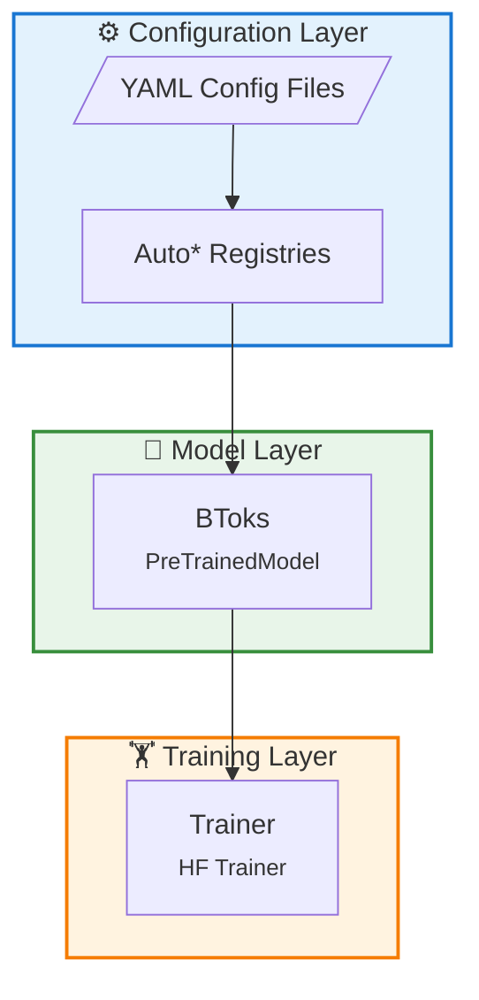
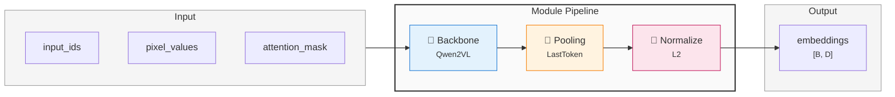
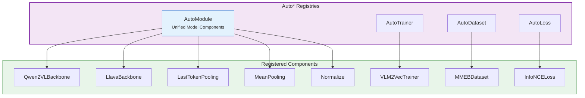

# Architecture Overview

> **Version**: 0.1
> **Updated**: 2026-01-25
> **Status**: In Progress
> **Architecture Design Version**: 1.0

## 1. Design Philosophy

BToks's architecture follows these core principles:

### 1.1 Configuration-Driven, Minimal Code

- **YAML Controls Everything**: Model architecture, training parameters, data flow all defined via config files
- **Zero-Code Switching**: Switch model variants (VLM2Vec, BToks) by modifying configuration
- **Inheritance and Reuse**: Configuration supports `_inherit_` directive for hierarchical inheritance

📖 **Detailed Documentation**: [Configuration System](./config-system.md)

### 1.2 Modular Pipeline, Swappable Components

- **Pipeline Architecture**: Model consists of sequential modules, modules communicate via `features` dict
- **Registry-Driven**: All components managed via registry, supporting dynamic discovery and replacement
- **Consistent Interface**: All modules follow unified `forward(features) -> features` pattern

📖 **Detailed Documentation**: [Module Pipeline System](./module-pipeline.md) | [Registry System](./registry-system.md)

### 1.3 Benchmarking Mature Frameworks

- **sentence-transformers**: Module pipeline design, features dict passing
- **HuggingFace Transformers**: Inherit `PreTrainedModel`/`PretrainedConfig`, support `from_pretrained()`

📖 **Detailed Documentation**: [BToks API](../api/model.md) | [Training System](./training-system.md)

---

## 2. System Architecture

### 2.1 System Overview

BToks uses a three-layer architecture with clear data flow from configuration to training:



### 2.2 Model Pipeline Architecture

BToks uses modular pipeline design where each module processes a `features` dict and passes it to the next:



**Data Flow Details**:

| Stage | Module | Input | Output |
|-------|--------|-------|--------|
| 1 | Backbone | `input_ids`, `pixel_values`, `attention_mask` | `+ last_hidden_state` |
| 2 | Pooling | `last_hidden_state`, `attention_mask` | `+ embeddings` |
| 3 | Normalize | `embeddings` | `embeddings` (normalized) |

### 2.3 Registry System

All components are managed through `Auto*` registries, enabling config-driven dynamic instantiation:



**Usage**:

```python
from vlm2emb import AutoModule

# Instantiate from config (recommended)
backbone = AutoModule.from_config({"type": "Qwen2VLBackbone", "model_name_or_path": "..."})
pooling = AutoModule.from_config({"type": "LastTokenPooling"})

# Direct build
normalize = AutoModule.build("Normalize")

# List all available modules
print(AutoModule.list_modules())
```

---

## 3. Core Abstractions

### 3.1 BToksConfig

Inherits from `VLM2EmbConfig` and is the primary configuration class for BToks
models. The `vlm2emb` Python namespace remains the public import namespace for
the current codebase.

```python
from vlm2emb import BToksConfig

config = BToksConfig(
    modules=[
        {"type": "Qwen2VLBackbone", "model_name_or_path": "Qwen/Qwen2-VL-7B-Instruct"},
        {"type": "LastTokenPooling"},
        {"type": "Normalize"},  # Add/remove this to control normalization
    ],
)
```

**Key Attributes**:
- `modules`: Module configuration list, defines pipeline structure
- `model_type`: Fixed as `"btoks"`

**Normalization Control**: Add or remove `Normalize` module in `modules` list to control output normalization.

### 3.2 BToks

Inherits from `transformers.PreTrainedModel`, core model class.

```python
from vlm2emb import BToks, create_model

# Method 1: Create from config
model = create_model(config)

# Method 2: Load from pretrained
model = BToks.from_pretrained("public-model-or-checkpoint")

# Inference: Use forward() + processor
inputs = processor(text=["query"], images=[pil_image], return_tensors="pt")
inputs = {k: v.to(model.device) for k, v in inputs.items()}
features = model(**inputs)
embeddings = features["embeddings"]

# Training forward
features = model(input_ids=tokens, attention_mask=mask, pixel_values=images)
```

**Core Methods**:
- `forward()`: Training and inference forward pass, returns features dict
- `similarity()`: Removed, implement by user

### 3.3 Trainer

Inherits from `transformers.Trainer`, extends embedding training support.

```python
from vlm2emb.training import Trainer
from transformers import TrainingArguments

args = TrainingArguments(
    output_dir="./output",
    per_device_train_batch_size=8,
    learning_rate=1e-5,
)

trainer = Trainer(
    model=model,
    args=args,
    train_dataset=dataset,
    data_collator=collator,
)

trainer.train()
```

**Extended Features**:
- Custom `compute_loss()` for contrastive learning
- `ChunkSampler` for interleaved datasets
- Built-in distributed contrastive loss

### 3.4 Module

All pipeline modules directly inherit `nn.Module`, following unified `forward` interface:

```python
import torch.nn as nn

class MyModule(nn.Module):
    def forward(self, **features) -> dict[str, Tensor]:
        """Process features and return new/modified keys."""
        # Get input from features
        hidden_state = features["last_hidden_state"]

        # Process...
        result = self.process(hidden_state)

        # Return new or modified keys (framework automatically merges to features)
        return {"embeddings": result}
```

**Interface Conventions**:

- Input: `**features` dict (contains previous module outputs)
- Output: Can return complete `features` dict, or just new/modified key-value pairs
- No need to inherit specific base class, just follow this convention

**Built-in Modules**:

| Module | Type | Description |
|--------|------|-------------|
| `Qwen2VLBackbone` | Backbone | Qwen2-VL backbone network |
| `LastTokenPooling` | Pooling | Last token pooling (VLM2Vec) |
| `MeanPooling` | Pooling | Mean pooling |
| `Normalize` | Transform | L2 normalization |

---

## 4. Technology Stack

| Component | Technology | Version Requirements |
|-----------|------------|----------------------|
| **Language** | Python | ≥3.11 |
| **ML Framework** | PyTorch | ≥2.0.0 |
| **Model Library** | Transformers | ≥4.37.0 |
| **Configuration** | OmegaConf | ≥2.3.0 |
| **Distributed** | DeepSpeed | ≥0.12.0 |
| **PEFT** | PEFT | ≥0.7.0 |
| **Code Quality** | Ruff | ≥0.1.0 |
| **Testing** | pytest | ≥7.0 |

---

## 5. Project Structure

```
src/vlm2emb/
├── __init__.py              # Public API exports
├── model.py                 # BToks, VLM2EmbConfig, create_model
├── config.py                # Config loader (OmegaConf)
├── registry.py              # Registry base class
├── auto.py                  # Auto* registry instances
├── exceptions.py            # Exception definitions
│
├── modules/                 # Pipeline modules
│   ├── backbone.py          # Qwen2VLBackbone
│   └── pooling.py           # LastTokenPooling, MeanPooling, Normalize
│
├── training/                # Training framework
│   ├── trainer.py           # Trainer (inherits HF Trainer)
│   ├── losses/              # Loss functions
│   └── grad_cache/          # Gradient cache
│
├── data/                    # Data pipeline
│   ├── datasets/            # Dataset implementations
│   ├── collators/           # Batch collators
│   └── preprocessing/       # Preprocessing utilities
│
└── evaluation/              # Evaluation modules
    ├── metrics.py           # Evaluation metrics
    └── eval_dataset.py      # Evaluation dataset
```

---

## 6. Quick Start

### 6.1 Installation

```bash
pip install vlm2emb
```

### 6.2 Inference

```python
import torch
from vlm2emb import BToks
from transformers import AutoProcessor

# Load pretrained model and processor (follows HF standard)
model = BToks.from_pretrained("public-model-or-checkpoint")
processor = AutoProcessor.from_pretrained("public-model-or-checkpoint")

# Preprocess
inputs = processor(
    text=["What is in this image?"],
    images=[pil_image],
    return_tensors="pt"
)
inputs = {k: v.to(model.device) for k, v in inputs.items()}

# Forward pass to get embeddings
with torch.no_grad():
    features = model(**inputs)

embeddings = features["embeddings"]

# Subsequent processing (similarity calculation, etc.) implemented by user
```

### 6.3 Training

```python
from vlm2emb import create_model
from vlm2emb.config import load_config
from vlm2emb.training import Trainer

# Load config
config = load_config("configs/presets/vlm2vec_qwen2vl_2b.yaml")

# Create model
model = create_model(config)

# Train
trainer = Trainer(model=model, args=args, train_dataset=dataset)
trainer.train()
```

---

## 7. Related Documents

- [Module Pipeline System](./module-pipeline.md) - Module design details
- [Registry System](./registry-system.md) - Component registration mechanism
- [Configuration System](./config-system.md) - YAML configuration details
- [Training System](./training-system.md) - Trainer design
- [API Reference](../api/model.md) - BToks API
