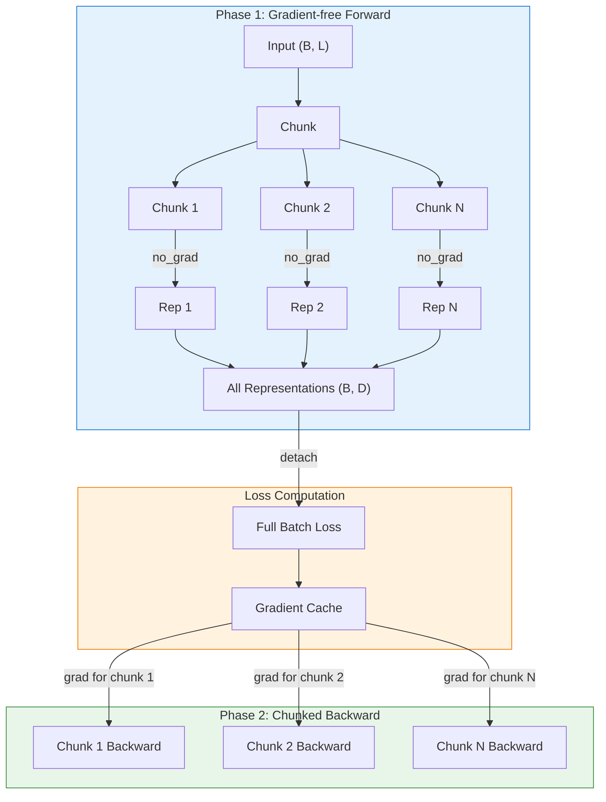

# Training System

> **Version**: 0.1
> **Updated**: 2026-01-25
> **Architecture Design Version**: 1.0
> **Reference**: HuggingFace Trainer, GradCache

## 1. Design Philosophy

### 1.1 Inheriting HuggingFace Trainer

BToks's training system directly inherits HuggingFace Trainer, maximizing reuse of mature training infrastructure:

| Advantage | Description |
|-----------|-------------|
| **Ecosystem Compatibility** | Seamless integration with HuggingFace ecosystem (Accelerate, DeepSpeed, FSDP) |
| **Complete Features** | Automatically get checkpointing, logging, evaluation |
| **Minimal Intrusion** | Only override necessary methods (`compute_loss`, `training_step`) |
| **Easy Extension** | Add new features via inheritance |

### 1.2 Trainer Hierarchy

```
HuggingFace Trainer
        │
        ▼
    Trainer (vlm2emb)
        │  - Basic contrastive learning support
        │  - (query, positive) pair training
        │  - Distributed loss functions
        │
        ▼
  VLM2VecTrainer
        │  - GradCache support
        │  - VLM2Vec-specific parameters
        │  - Large batch training optimization
        │
        ▼
   BToksTrainer etc.
```

---

## 2. Trainer Architecture

### 2.1 Base Trainer

`Trainer` class extends HuggingFace Trainer, supporting contrastive learning for embedding models:

```python
from vlm2emb.training import Trainer
from transformers import TrainingArguments

args = TrainingArguments(
    output_dir="./output",
    per_device_train_batch_size=8,
    learning_rate=1e-5,
    num_train_epochs=3,
    bf16=True,
)

trainer = Trainer(
    model=model,
    args=args,
    train_dataset=dataset,
    data_collator=collator,
)

trainer.train()
```

### 2.2 Core Method Overrides

#### compute_loss()

Process contrastive loss computation for `(query, positive)` pairs:

```python
def compute_loss(
    self,
    model: nn.Module,
    inputs: dict[str, dict],
    return_outputs: bool = False,
    num_items_in_batch: int | None = None,
) -> Tensor | tuple[Tensor, Any]:
    """Compute contrastive loss for (qry, pos) pairs.

    Args:
        model: Model
        inputs: Dict containing "query", "positive", "metadata" keys
        return_outputs: Whether to return model outputs
        num_items_in_batch: Number of samples in batch (unused)

    Returns:
        Loss tensor, optionally containing outputs
    """
    # Extract inputs
    qry_inputs = inputs["query"]
    pos_inputs = inputs["positive"]

    # Remove metadata before forward pass (not needed for model)
    qry_inputs = {k: v for k, v in qry_inputs.items() if k != "metadata"}
    pos_inputs = {k: v for k, v in pos_inputs.items() if k != "metadata"}

    # Forward pass
    qry_outputs = model(**qry_inputs)
    pos_outputs = model(**pos_inputs)

    qry_embeds = qry_outputs["embeddings"]
    pos_embeds = pos_outputs["embeddings"]

    # Compute contrastive loss
    loss = self.loss_fn(qry_embeds, pos_embeds)

    if return_outputs:
        return loss, {"qry_embeds": qry_embeds, "pos_embeds": pos_embeds}
    return loss
```

#### _setup_loss_fn()

Automatically select loss function based on distributed environment:

```python
def _setup_loss_fn(self) -> None:
    """Set up contrastive loss function."""
    from vlm2emb.training.losses.contrastive import (
        ContrastiveLoss,
        DistributedContrastiveLoss,
    )

    if self.accelerator.use_distributed:
        self.loss_fn = DistributedContrastiveLoss(temperature=self.args.temperature)
    else:
        self.loss_fn = ContrastiveLoss(temperature=self.args.temperature)
```

### 2.3 Input Data Format

Trainer expects input format (provided by Collator):

```python
inputs = {
    "query": {
        "input_ids": Tensor,        # (B, L_q)
        "attention_mask": Tensor,   # (B, L_q)
        "pixel_values": Tensor,     # (N_q, C, H, W)
        "image_grid_thw": Tensor,   # (N_q, 3)
    },
    "positive": {
        "input_ids": Tensor,        # (B, L_p)
        "attention_mask": Tensor,   # (B, L_p)
        "pixel_values": Tensor,     # (N_p, C, H, W)
        "image_grid_thw": Tensor,   # (N_p, 3)
    },
    "metadata": [                   # Optional, for debugging
        {"dataset_name": "mmeb", "task": "retrieval"},
        ...
    ],
}
```

### 2.4 BToks Generation Auxiliary Protocol

BToks generation loss does not reuse the raw embedding-path template directly. Instead, the trainer decorates each opposite target with an explicit generation boundary:

```text
<|im_start|>assistant
{target}
<|im_end|>
```

Key points:

- `generation_prefix_text` defaults to `"<|im_start|>assistant\n"`
- `generation_suffix_text` defaults to `"<|im_end|>"`
- the prefix header is always masked out of generation loss
- whether the suffix participates in generation loss is controlled by `include_generation_suffix_in_loss`
- `generation_kv_mode` defaults to `"compressed"`, which makes generation loss use compressed KV cache

This serves two purposes:

1. The first content token always has a stable predecessor, so generation loss does not drop the first target token.
2. Training and later `btoks cache -> assistant span` decoding use the same start/end protocol.

BToks ablation supports two orthogonal switches:

| `model.modules.injector.num_tokens` | `train.args.generation_kv_mode` | Embedding source | Generation KV source |
|-------------------------------------|--------------------------------|------------------|----------------------|
| `> 0` | `"compressed"` | btoks token pooling | btoks token KV |
| `> 0` | `"full"` | btoks token pooling | full KV cache |
| `0` | `"compressed"` | last valid token | last valid token KV |
| `0` | `"full"` | last valid token | full KV cache |

When `num_tokens=0`, `BToksTokenInjector` does not register or append extra tokens, and `BToksPooling` uses the hidden state at the last non-zero `attention_mask` position. If `attention_mask` is absent, it falls back to the sequence tail.

These combinations do not need dedicated presets. Add dotlist overrides at the end of the training command:

```bash
python scripts/train.py configs/presets/btoks_qwen2vl_2b_v1.yaml \
    model.modules.injector.num_tokens=0

python scripts/train.py configs/presets/btoks_qwen2vl_2b_v1.yaml \
    train.args.generation_kv_mode=full

python scripts/train.py configs/presets/btoks_qwen2vl_2b_v1.yaml \
    model.modules.injector.num_tokens=0 \
    train.args.generation_kv_mode=full
```

In addition, Qwen processor wrappers now canonicalize visual placeholders at the processor layer into the official boundary format, for example:

```text
<|vision_start|><|image_pad|><|vision_end|>
<|vision_start|><|video_pad|><|vision_end|>
```

This normalization belongs to processor input canonicalization rather than dataset text transforms.

---

## 3. PEFT / LoRA Integration

### 3.1 apply_peft

PEFT application is centrally managed through the `apply_peft` function in `training/train.py`, keeping the BToks model pure:

```python
from vlm2emb.training.train import apply_peft

model = apply_peft(model, {
    "type": "lora",
    "r": 16,
    "alpha": 64,
    "target_modules": "q_proj,k_proj,v_proj,o_proj",
    "dropout": 0.1,
    "use_dora": True,
})
```

### 3.2 Automatic modules_to_save Inference

`apply_peft` automatically infers `modules_to_save` (unless explicitly specified by user). Inference logic (`_infer_modules_to_save`):

| Module Type | Handling |
|-------------|----------|
| `BackboneBase` subclass | Skipped (LoRA handles via `target_modules`) |
| Zero-parameter modules (Pooling, Normalize) | Skipped |
| Other parameterized modules (e.g. BottleneckTokens) | Added to `modules_to_save` |

### 3.3 Two-Step Loading (Adapter Recovery)

Recover from saved adapter for training or inference:

```python
from vlm2emb import create_model, BToks
from peft import PeftModel

# Method 1: Rebuild from YAML config
base_model = create_model(yaml_config)
model = PeftModel.from_pretrained(base_model, adapter_path)

# Method 2: From saved base model
base_model = BToks.from_pretrained(base_model_path)
model = PeftModel.from_pretrained(base_model, adapter_path)
```

### 3.4 Merge and Export

```python
# Merge adapter into base model and save full model
merged = model.merge_and_unload()
merged.save_pretrained("./merged_model")
```

---

## 4. VLM2VecTrainer

### 4.1 Extended Features

`VLM2VecTrainer` adds on top of base Trainer:

| Feature | Description |
|---------|-------------|
| **GradCache** | Memory-efficient large batch training |
| **VLM2Vec Parameters** | temperature, max_length, etc. |
| **BatchInterleaveSampler** | Interleaved dataset sampling support |

### 4.2 VLM2VecTrainingArgs

```python
from vlm2emb.training.trainers import VLM2VecTrainingArgs

args = VLM2VecTrainingArgs(
    output_dir="./output",
    per_device_train_batch_size=8,

    # VLM2Vec-specific parameters
    temperature=0.02,           # Contrastive loss temperature
    max_length=512,             # Maximum sequence length

    # GradCache parameters
    use_grad_cache=True,        # Enable GradCache
    gc_q_chunk_size=4,          # Query chunk size
    gc_p_chunk_size=4,          # Passage chunk size

    # Interleaved dataset sampling
    interleave_batch_size=8,    # BatchInterleaveSampler batch size
    interleave_stopping_strategy="all_exhausted",
    interleave_shuffle_within_dataset=False,
)
```

### 4.3 Usage Example

```python
from vlm2emb.training.trainers import VLM2VecTrainer, VLM2VecTrainingArgs

args = VLM2VecTrainingArgs(
    output_dir="./output",
    per_device_train_batch_size=8,
    temperature=0.02,
    use_grad_cache=True,
    gc_q_chunk_size=4,
    gc_p_chunk_size=4,
    bf16=True,
)

trainer = VLM2VecTrainer(
    model=model,
    args=args,
    train_dataset=dataset,
    data_collator=collator,
)

trainer.train()
```

---

## 5. Loss Functions

### 5.1 ContrastiveLoss

Basic InfoNCE contrastive loss:

```python
from vlm2emb.training.losses import ContrastiveLoss

loss_fn = ContrastiveLoss(temperature=0.02)

# Compute loss
loss = loss_fn(query_embeds, positive_embeds)
```

**Implementation Principle**:

```python
class ContrastiveLoss(nn.Module):
    """InfoNCE contrastive loss.

    For each query in batch, its corresponding positive is the positive sample,
    all other positives are negative samples.
    """

    def __init__(self, temperature: float = 0.02):
        super().__init__()
        self.temperature = temperature
        self.cross_entropy = nn.CrossEntropyLoss()

    def forward(self, query: Tensor, positive: Tensor) -> Tensor:
        """Compute InfoNCE loss.

        Args:
            query: Query embeddings (B, D)
            positive: Positive embeddings (B, D)

        Returns:
            Scalar loss
        """
        # Compute similarity matrix
        scores = torch.matmul(query, positive.T) / self.temperature  # (B, B)

        # Diagonal is positive samples
        labels = torch.arange(scores.size(0), device=query.device)

        return self.cross_entropy(scores, labels)
```

### 5.2 DistributedContrastiveLoss

Distributed training contrastive loss, gathering all embeddings across GPUs:

```python
from vlm2emb.training.losses import DistributedContrastiveLoss

loss_fn = DistributedContrastiveLoss(
    temperature=0.02,
    scale_loss=True,  # Scale loss by world_size
)
```

**Implementation Principle**:

```python
class DistributedContrastiveLoss(nn.Module):
    """Distributed contrastive loss.

    Uses all_gather to collect embeddings from all GPUs,
    computes contrastive loss on global batch.
    """

    def forward(self, query: Tensor, positive: Tensor) -> Tensor:
        # Collect embeddings from all GPUs (retain gradients)
        all_query = self._gather_with_grad(query)      # (B*W, D)
        all_positive = self._gather_with_grad(positive)  # (B*W, D)

        # Compute global similarity matrix
        scores = torch.matmul(all_query, all_positive.T) / self.temperature

        # Calculate label offset for current rank
        rank = dist.get_rank()
        batch_size = query.size(0)
        labels = torch.arange(batch_size, device=query.device) + rank * batch_size

        return self.cross_entropy(scores, labels)

    def _gather_with_grad(self, tensor: Tensor) -> Tensor:
        """Gather tensors and retain gradients."""
        gathered = [torch.zeros_like(tensor) for _ in range(dist.get_world_size())]
        dist.all_gather(gathered, tensor)

        # Replace current rank's tensor to retain gradients
        gathered[dist.get_rank()] = tensor
        return torch.cat(gathered, dim=0)
```

### 5.3 InBatchContrastiveLoss

Contrastive loss for classification-style tasks:

```python
from vlm2emb.training.losses import InBatchContrastiveLoss

loss_fn = InBatchContrastiveLoss(temperature=0.02)

# Support multiple positive samples
loss = loss_fn(query_embeds, positive_embeds, labels)
```

---

## 6. GradCache

### 6.1 Design Motivation

Contrastive learning requires large batch size for sufficient negative samples. However, large batches cause out-of-memory issues. GradCache solves this through two-phase computation:

| Phase | Operation | Memory Usage |
|-------|-----------|--------------|
| **Phase 1** | Gradient-free forward, get all representations | Low (no computation graph) |
| **Phase 2** | Chunked forward + immediate backward | Low (only process one chunk at a time) |

### 6.2 Working Principle



### 6.3 Functional API

BToks uses functional `grad_cache_accumulate` API:

```python
from vlm2emb.training.grad_cache import grad_cache_accumulate

loss = grad_cache_accumulate(
    inputs=[qry_inputs, pos_inputs],      # Input list
    forward_fns=[forward_fn, forward_fn],  # Forward function list
    loss_fn=loss_fn,                       # Loss function
    chunk_sizes=[4, 4],                    # Chunk sizes
    backward_fn=backward_fn,               # Backward propagation function
    fp16=False,                            # Whether to use FP16
)
```

### 6.4 Implementation Details

```python
def grad_cache_accumulate(
    inputs: list[dict],
    forward_fns: list[Callable],
    loss_fn: Callable,
    chunk_sizes: list[int],
    backward_fn: Callable | None = None,
    fp16: bool = False,
) -> Tensor:
    """GradCache gradient accumulation.

    Args:
        inputs: List of input dicts [qry_inputs, pos_inputs]
        forward_fns: List of forward functions
        loss_fn: Loss function (qry_reps, pos_reps) -> loss
        chunk_sizes: Chunk size for each input
        backward_fn: Custom backward function
        fp16: Whether to use FP16

    Returns:
        Loss value (detached)
    """
    # Phase 1: Gradient-free forward, collect all representations
    all_reps = []
    for inp, forward_fn, chunk_size in zip(inputs, forward_fns, chunk_sizes):
        chunks = split_into_chunks(inp, chunk_size)
        reps = []
        for chunk in chunks:
            with torch.no_grad():
                rep = forward_fn(chunk)
            reps.append(rep)
        all_reps.append(torch.cat(reps, dim=0))

    # Compute full batch loss and build gradient cache
    all_reps_with_grad = [r.requires_grad_(True) for r in all_reps]
    loss = loss_fn(*all_reps_with_grad)
    loss.backward()

    # Save gradient cache
    grad_cache = [r.grad for r in all_reps_with_grad]

    # Phase 2: Chunked forward + backward
    for i, (inp, forward_fn, chunk_size) in enumerate(zip(inputs, forward_fns, chunk_sizes)):
        chunks = split_into_chunks(inp, chunk_size)
        grad_chunks = split_into_chunks(grad_cache[i], chunk_size)

        for j, (chunk, grad_chunk) in enumerate(zip(chunks, grad_chunks)):
            rep = forward_fn(chunk)
            # Use cached gradients for backward propagation
            surrogate = torch.dot(rep.flatten(), grad_chunk.flatten())

            is_last = (i == len(inputs) - 1) and (j == len(chunks) - 1)
            if backward_fn:
                backward_fn(surrogate, is_last)
            else:
                surrogate.backward()

    return loss.detach()
```

### 6.5 Configuration Example

```yaml
# configs/presets/vlm2vec_grad_cache.yaml
trainer:
  type: vlm2vec_trainer

training_args:
  type: vlm2vec
  output_dir: ./output
  per_device_train_batch_size: 8
  learning_rate: 1e-5
  num_train_epochs: 3
  bf16: true

  # GradCache configuration
  use_grad_cache: true
  gc_q_chunk_size: 4
  gc_p_chunk_size: 4

  # Contrastive learning parameters
  temperature: 0.02
```

---

## 7. Distributed Training

### 7.1 Accelerate Integration

BToks supports distributed training via HuggingFace Accelerate:

```yaml
# Example Accelerate configuration saved outside the repository
compute_environment: LOCAL_MACHINE
distributed_type: MULTI_GPU
num_processes: 8
mixed_precision: bf16
```

Launch training:

```bash
accelerate launch \
    scripts/train.py configs/presets/vlm2vec_qwen2vl_2b.yaml
```

### 7.2 DeepSpeed Integration

Supports DeepSpeed ZeRO optimization:

```yaml
# Example DeepSpeed Accelerate configuration saved outside the repository
compute_environment: LOCAL_MACHINE
distributed_type: DEEPSPEED
deepspeed_config:
  zero_optimization:
    stage: 2
    offload_optimizer:
      device: cpu
  bf16:
    enabled: true
```

### 7.3 Distributed Loss Synchronization

In distributed training, `DistributedContrastiveLoss` automatically handles cross-GPU embedding collection:

```python
# Automatic loss function selection
if self.accelerator.use_distributed:
    self.loss_fn = DistributedContrastiveLoss(temperature=0.02)
else:
    self.loss_fn = ContrastiveLoss(temperature=0.02)
```

### 7.4 Gradient Synchronization Control

In GradCache mode, non-last chunks skip gradient synchronization for efficiency:

```python
def backward_fn(tensor: Tensor, is_last_backward: bool) -> None:
    if is_last_backward:
        # Last chunk: synchronize gradients
        self.accelerator.backward(tensor)
    else:
        # Non-last chunk: skip synchronization
        with self.accelerator.no_sync(model):
            self.accelerator.backward(tensor)
```

---

## 8. Checkpoint Management

### 8.1 Automatic Saving

Inherits HuggingFace Trainer checkpoint functionality:

```yaml
training:
  args:
    output_dir: ./output
    save_strategy: steps
    save_steps: 500
    save_total_limit: 3  # Keep at most 3 checkpoints
```

### 8.2 Checkpoint Structure

```
output/
├── checkpoint-500/
│   ├── config.json           # Model config
│   ├── model.safetensors     # Model weights
│   ├── optimizer.pt          # Optimizer state
│   ├── scheduler.pt          # LR scheduler state
│   ├── trainer_state.json    # Training state
│   └── train.args.bin     # Training arguments
├── checkpoint-1000/
│   └── ...
└── checkpoint-1500/
    └── ...
```

### 8.3 Resume Training

```python
trainer = VLM2VecTrainer(
    model=model,
    args=args,
    train_dataset=dataset,
    data_collator=collator,
)

# Resume from checkpoint
trainer.train(resume_from_checkpoint="./output/checkpoint-500")
```

Or via command line:

```bash
accelerate launch scripts/train.py configs/experiments/vlm2vec.yaml \
    train.args.resume_from_checkpoint=./output/checkpoint-500
```

### 8.4 Final Model Saving

Save final model after training:

```python
# Save model (follows HF standard)
model.save_pretrained("./final_model")
processor.save_pretrained("./final_model")

# Or push to Hub
model.push_to_hub("public-model-or-checkpoint")
processor.push_to_hub("public-model-or-checkpoint")
```

---

## 9. Samplers

### 9.1 BatchInterleaveSampler

Sampler for interleaved datasets, ensures consecutive samples stay together:

```python
from vlm2emb.training.samplers import BatchInterleaveSampler

sampler = BatchInterleaveSampler(
    dataset,
    batch_size=8,               # Batch size
    stopping_strategy="all_exhausted",  # Stopping strategy
    shuffle_within_dataset=True,  # Whether to shuffle within each sub-dataset
    seed=42,                    # Random seed
)
```

**Use Case**: When mixing multiple data sources for training, need to keep samples from same dataset together.

### 9.2 Configuration Example

```yaml
training_args:
  interleave_batch_size: 8                    # Enable BatchInterleaveSampler
  interleave_stopping_strategy: all_exhausted # Stopping strategy
  interleave_shuffle_within_dataset: false    # Read samples sequentially within each sub-dataset
```

---

## 10. Registry Integration

### 10.1 Trainer Registration

```python
from vlm2emb.auto import AutoTrainer

# Register custom Trainer
@AutoTrainer.register("my_trainer")
class MyTrainer(Trainer):
    pass

# Create from config
trainer = AutoTrainer.from_config(
    {"type": "vlm2vec_trainer"},
    model=model,
    args=training_args,
    train_dataset=dataset,
    data_collator=collator,
)
```

### 10.2 TrainingArgs Registration

```python
from vlm2emb.auto import AutoTrainingArgs

# Register custom TrainingArgs
@AutoTrainingArgs.register("my_args")
@dataclass
class MyTrainingArgs(TrainingArguments):
    custom_param: float = 0.1

# Create from config
args = AutoTrainingArgs.from_config({
    "type": "my_args",
    "output_dir": "./output",
    "custom_param": 0.2,
})
```

---

## 11. Complete Training Example

### 11.1 YAML Configuration

```yaml
# configs/experiments/vlm2vec.yaml
defaults:
  - /models/vlm2vec
  - /datasets/mmeb
  - /training/vlm2vec_grad_cache

model:
  modules:
    - type: Qwen2VLBackbone
      model_name_or_path: Qwen/Qwen2-VL-7B-Instruct
      dtype: bfloat16

    - type: LastTokenPooling

    - type: Normalize

training:
  trainer:
    type: vlm2vec_trainer

  args:
    output_dir: ./output/vlm2vec
    per_device_train_batch_size: 8
    learning_rate: 1e-5
    num_train_epochs: 1
    bf16: true
    temperature: 0.02
    use_grad_cache: true
    gc_q_chunk_size: 4
    gc_p_chunk_size: 4
```

### 11.2 Training Script

```python
# scripts/train.py
from vlm2emb import create_model
from vlm2emb.config import load_config
from vlm2emb.data import create_dataset, create_collator
from vlm2emb.training import create_trainer

def main():
    # Load config
    config = load_config("configs/experiments/vlm2vec.yaml")

    # Create model
    model = create_model(config)

    # Create dataset and collator
    dataset = create_dataset(config)
    collator = create_collator(config)

    # Create trainer
    trainer = create_trainer(
        config=config,
        model=model,
        train_dataset=dataset,
        data_collator=collator,
    )

    # Train
    trainer.train()

    # Save
    model.save_pretrained(config.training.args.output_dir)

if __name__ == "__main__":
    main()
```

### 11.3 Launch Commands

```bash
# Single GPU
python scripts/train.py configs/experiments/vlm2vec.yaml

# Multi GPU (Accelerate)
accelerate launch scripts/train.py configs/experiments/vlm2vec.yaml

# DeepSpeed
accelerate launch scripts/train.py configs/experiments/vlm2vec.yaml \
    train.args.deepspeed=path/to/deepspeed_config.json
```

---

## 12. Related Documents

- [Architecture Overview](./overview.md) - Overall architecture design
- [Module Pipeline System](./module-pipeline.md) - Model module design
- [Configuration System](./config-system.md) - YAML configuration details
- [Data Pipeline](../datasets/architecture-data-pipeline.md) - Datasets and Collator
- [Trainer API](../api/trainer.md) - Trainer API Reference
