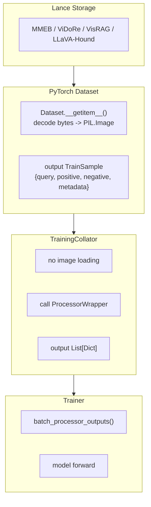

# Data Pipeline

This document describes the current training data pipeline in BToks, from Lance storage to model inputs.

> Related references:
> - [Format Specification](./format-spec.md)
> - [Custom Dataset Development Guide](./guide-custom-dataset.md)

## 1. Current Training Pipeline



Key points:
- Images and frames are decoded in `Dataset.__getitem__()`, not in the collator.
- Migrated training datasets output `TrainSample`; each side is `MultiModalInput = {"text", "media"}`.
- Lance storage does not require one unified training-field schema; conversion preserves source fields and necessary derived media, while the runtime Dataset interprets the layout and constructs `TrainSample`.
- Training-side normalization is limited to token / whitespace cleanup. Prompt wording is kept stable.

## 2. Unified Training Output

Defined in `src/vlm2emb/data/schema.py`:

```python
class MediaInput(TypedDict, total=False):
    kind: str
    content: Any
    metadata: dict[str, Any]


class MultiModalInput(TypedDict):
    text: str
    media: list[MediaInput]


class TrainSample(TypedDict, total=False):
    query: MultiModalInput
    positive: MultiModalInput
    negative: MultiModalInput
    metadata: dict[str, Any]
```

Constraints:
- `MultiModalInput` stores only model-facing input fields: `text` and `media`
- `media` belongs to each side's `MultiModalInput`, not to the top-level `TrainSample`
- dataset name, subset, source row, and similar passthrough values live in `metadata`
- `negative.text == ""` and `negative.media == []` means there is no negative

## 3. Dataset Responsibilities

Training datasets are responsible for only three things:

1. Read Lance or Parquet rows
2. Decode media bytes into `PIL.Image`
3. Assemble a `TrainSample`

Current official training loaders:

| Family | Registry name | Implementation |
|--------|---------------|----------------|
| MMEB | `mmeb_train` | `src/vlm2emb/data/datasets/mmeb_train.py` |
| ViDoRe | `vidore_train` | `src/vlm2emb/data/datasets/vidore.py` |
| VisRAG | `visrag_train` | `src/vlm2emb/data/datasets/visrag.py` |
| LLaVA-Hound | `llavahound_train` | `src/vlm2emb/data/datasets/llavahound.py` |

Structure:
- MMEB training uses a raw sample table plus an image side table
- ViDoRe / VisRAG use single-table Lance storage
- LLaVA-Hound uses dual-table storage: frames + video_instruction
- Video training data defaults to `data/videos.lance` for aggregated raw videos and `data/frames.lance` for pre-extracted derived frames. Default training configs should fail when `data/frames.lance` is missing; only explicit raw-video compatibility configs may decode source videos at runtime.

## 4. Collator Responsibilities

The current collator is implemented in `src/vlm2emb/data/collators/training_collator.py`.

It no longer loads images. It only:

1. Reads `query / positive / negative`
2. Calls the `ProcessorWrapper`
3. Returns `List[Dict]` for each field

Output sketch:

```python
{
    "query": [processor_output_0, processor_output_1, ...],
    "positive": [...],
    "negative": [processor_output_or_none, ...],
    "dataset_name": [...],
}
```

Notes:
- The collator does not return batched tensors
- Actual batching happens inside the trainer via `batch_processor_outputs()`

## 5. Token and Text Normalization Rules

Training currently allows only two classes of normalization:

1. Token normalization
- image: `<|image_pad|>`
- video: `<|video_pad|>`
- legacy image tokens may be accepted as input, but outputs are normalized to standard tokens

2. Whitespace normalization
- `\r\n` / `\r` -> `\n`
- strip trailing spaces on each line
- clean dirty joins
- usually keep a single trailing newline for query text and visual-token template text
- strip trailing newlines for text-only candidates that are class names, single words, or phrase-like answers that do not form a complete sentence, such as `cereal`, `abseiling`, or `nokia`
- keep or add one trailing newline for complete sentences, multi-sentence captions, or query / candidate text assembled from an instruction
- generic candidate instructions supplied by a parser or config should be complete sentences, such as `Represent the given cropped image of the object.`, then keep one trailing newline as a complete prompt block
- handle borderline cases in the dataset-specific config and sample review instead of applying a mechanical length rule

Training does not allow:
- family prompt rewrites
- query / positive / negative wording rewrites

## 6. Training Conversion Tooling

Training conversion tooling remains under `scripts/convert/train/`.

Python converters that are still part of the supported tool layer:

| Script | Purpose |
|--------|---------|
| `convert_mmeb_train_to_lance.py` | MMEB-train -> Lance |
| `convert_parquet_to_lance.py` | HuggingFace-style parquet -> Lance |
| `convert_jsonl_to_lance.py` | JSONL -> Lance |
| `convert_video_frames_to_lance.py` | video frame directories -> Lance |
| `convert_llavahound_train_to_lance.py` | raw-preserving LLaVA-Hound dual tables -> Lance |

Notes:
- Historical shell wrappers were machine-specific wrappers with hardcoded paths and have been removed from the maintained tool layer.
- New train conversion logic should prefer the Python converter layer instead of adding more local shell wrappers.

## 7. Checklist for New Training Datasets

- Reuse one of the existing 4 Lance schemas whenever possible
- Dataset output must be `TrainSample`
- Decode images inside the dataset, not in the collator
- Limit normalization to tokens / whitespace; do not rewrite prompt wording
- If a new train conversion script is needed, prefer a Python tool under `scripts/convert/train/` instead of a machine-local shell wrapper
