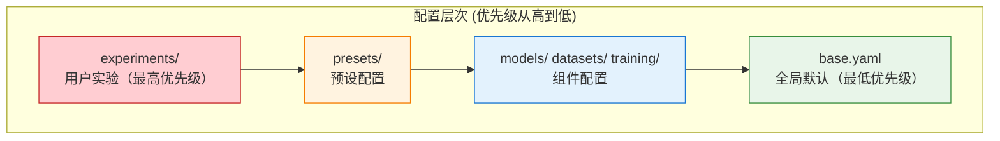

# 配置系统

> **版本**: 0.2
> **更新日期**: 2026-03-26
> **模块**: `vlm2emb.config`
> **依赖**: OmegaConf

BToks 采用基于 OmegaConf 的 YAML 配置系统，支持继承、插值和验证。

---

## 目录

1. 设计原则
2. 配置结构规范
3. 配置关键字规范
4. 快速开始
5. 配置加载 API
6. 配置继承
7. 变量插值
8. CLI 覆盖
9. 配置文件组织
10. 异常处理
11. 最佳实践
12. 相关文档

---

## 1. 设计原则

### 1.1 核心理念

| 原则 | 说明 |
|------|------|
| **YAML 为主** | 所有配置通过 YAML 文件定义，代码中不硬编码参数 |
| **继承优于复制** | 通过 `_inherit_` 指令复用配置，避免重复 |
| **验证前置** | 加载时即进行结构验证，早期发现错误 |
| **类型安全** | 使用 OmegaConf DictConfig，支持类型检查 |

---

## 2. 配置结构规范

### 2.1 顶层键定义

BToks 配置采用 **4 个顶层键** 组织配置结构：

| 顶层键 | 语义 | train() 消费 | evaluate() 消费 |
|--------|------|--------------|-----------------|
| **model** | 模型架构定义 | ✓ | ✓ (无运行时 checkpoint 时) |
| **peft** | PEFT 训练策略 | ✓ | ✗ (忽略) |
| **train** | 训练独有配置 | ✓ | ✗ (忽略) |
| **eval** | 评测配置 | ✓ (训练中评测) | ✓ (独立评测) |

### 2.2 配置模板

**仅训练配置**：
```yaml
# configs/presets/vlm2vec_qwen2vl_2b.yaml
model:
  _inherit_: ../models/vlm2vec.yaml

peft:
  _inherit_: ../peft/lora_default.yaml

train:
  dataset:
    type: combined
    datasets:
      _inherit_: ../datasets/mmeb_train.yaml

  collator:
    type: training

  trainer:
    type: vlm2vec_trainer

  args:
    _inherit_: ../training/vlm2vec_base.yaml
    output_dir: ./outputs/vlm2vec_baseline
    run_name: vlm2vec_baseline
```

**仅评测配置（运行时 checkpoint）**：
```yaml
# configs/experiments/eval_mmeb.yaml
eval:
  _inherit_: ../eval/mmeb.yaml
  batch_size: 8
```

运行时通过 CLI 提供 checkpoint：

```bash
python scripts/eval.py configs/experiments/eval_mmeb.yaml \
  --checkpoint ./outputs/vlm2vec_lora/checkpoint-5000
```

**仅评测配置（full model）**：
```yaml
# configs/experiments/eval_full_model.yaml
model:
  _inherit_: ../models/vlm2vec.yaml

eval:
  type: mmeb
  path: ~/datasets/MMEB-V2
  batch_size: 4
```

**完整配置（训练 + 评测）**：
```yaml
# configs/presets/vlm2vec_with_eval.yaml
model:
  _inherit_: ../models/vlm2vec.yaml

peft:
  _inherit_: ../peft/lora_default.yaml

train:
  dataset:
    type: combined
    datasets:
      _inherit_: ../datasets/mmeb_train.yaml

  collator:
    type: training

  trainer:
    type: vlm2vec_trainer

  args:
    _inherit_: ../training/vlm2vec_base.yaml
    output_dir: ./outputs/vlm2vec_with_eval
    do_eval: true
    eval_strategy: steps
    eval_steps: 500

eval:
  type: mmeb
  path: ~/datasets/MMEB-V2
  batch_size: 4
```

### 2.3 键的解析优先级

1. **checkpoint 是运行时参数**：独立评测时的 checkpoint 通过 `scripts/eval.py --checkpoint ...` 提供，不属于配置语义
2. **train 仅用于训练**：`evaluate()` 完全忽略 `train` 下的所有配置
3. **eval 共享于训练和评测**：
   - 训练时：用于 `Trainer.evaluate()` 中间评测
   - 评测时：用于独立评测流程

---

## 3. 配置关键字规范

### 3.1 路径关键字统一

| 旧关键字 | 新关键字 | 说明 |
|----------|----------|------|
| `data_path` | `path` | 评测数据集路径 |
| `processor_name_or_path` | (已移除) | 由 model 配置自动推断 |

### 3.2 类型关键字

配置中使用 `type` 字段指定具体实现类：

```yaml
train:
  dataset:
    type: combined          # 数据集类型

  collator:
    type: training          # Collator 类型

  trainer:
    type: vlm2vec_trainer   # Trainer 类型

  args:
    type: vlm2vec           # TrainingArgs 类型
```

训练数据集组合当前使用 `combined`。多数据集权重、名称和子数据集配置直接写在训练配置中，不再通过旧的 recipe artifact 层间接加载。

### 3.3 _inherit_ 关键字

`_inherit_` 用于配置继承，支持以下场景：

```yaml
# 顶层继承
_inherit_: ../base.yaml

# 嵌套继承
model:
  _inherit_: ../models/vlm2vec.yaml

train:
  dataset:
    datasets:
      _inherit_: ../datasets/mmeb_train.yaml
```

### 3.4 系统关键字

系统保留关键字，不可作为用户配置键：

| 关键字 | 用途 |
|--------|------|
| `_inherit_` | 配置继承 |
| `_type_` | OmegaConf 类型标记 |
| `_args_` | OmegaConf 参数标记 |

---

## 4. 快速开始

### 4.1 加载配置

```python
from vlm2emb.config import load_config

# 加载配置文件（支持继承和插值）
config = load_config("configs/experiments/vlm2vec.yaml")

# 访问配置值
print(config.model.type)                    # "vlm2emb"
print(config.train.args.learning_rate)      # 1e-5
```

### 4.2 创建模型

```python
from vlm2emb import create_model
from vlm2emb.config import load_config

config = load_config("configs/experiments/vlm2vec.yaml")
model = create_model(config.model)
```

### 4.3 应用 CLI 覆盖

```python
from vlm2emb.config import load_config, apply_overrides

config = load_config("configs/experiments/vlm2vec.yaml")

# 应用命令行覆盖
config = apply_overrides(config, [
    "train.args.learning_rate=2e-5",
    "train.args.num_train_epochs=5",
])
```

> **注意**
> - `checkpoint` 不是合法配置键；独立评测时只通过 `--checkpoint` 提供
> - 即使 `overrides` 中出现 `checkpoint=...`，当前评测流程也不会读取或使用它

---

## 5. 配置加载 API

### 5.1 load_config

主要的配置加载函数，支持继承和插值。

```python
def load_config(config_path: str | Path) -> Config:
    """Load a single configuration file with inheritance support.

    加载支持继承的单个配置文件。

    Args:
        config_path: YAML 配置文件路径

    Returns:
        已应用继承和解析插值的 DictConfig

    Raises:
        ConfigNotFoundError: 文件不存在
        ConfigSyntaxError: YAML 语法无效
        ConfigInheritanceError: 循环继承
        ConfigInterpolationError: 插值解析失败
    """
```

**示例**：

```python
from vlm2emb.config import load_config

# 基本用法
config = load_config("configs/experiments/vlm2vec.yaml")

# 相对路径（相对于当前工作目录）
config = load_config("./my_config.yaml")

# 绝对路径
config = load_config("/path/to/config.yaml")
```

### 5.2 apply_overrides

应用 CLI 风格的配置覆盖。

```python
def apply_overrides(config: Config, overrides: list[str]) -> Config:
    """Apply CLI overrides to configuration.

    应用 CLI 覆盖到配置。

    Args:
        config: 已加载的配置 DictConfig
        overrides: dotlist 格式的覆盖字符串列表

    Returns:
        已应用覆盖的配置
    """
```

**支持的语法**：

| 语法 | 说明 | 示例 |
|------|------|------|
| `key=value` | 设置值 | `learning_rate=1e-4` |
| `key.nested=value` | 嵌套键 | `model.backbone.type=Qwen2VL` |
| `key=null` | 删除键 | `debug.profiler=null` |
| `+key=value` | 添加新键 | `+experiment.tag=test` |
| `~key` | 删除键 | `~debug` |

### 5.3 to_native_config

`load_config()` 的职责到 OmegaConf 容器为止；进入大多数 runtime 入口前，应该通过 `to_native_config()` 或等价原生容器出口把配置收敛为 `dict` / `list`。

```python
from vlm2emb.config import load_config, to_native_config

config = load_config("configs/presets/vlm2vec_qwen2vl_2b.yaml")
native_config = to_native_config(config, resolve=True)
```

推荐边界：

1. `vlm2emb.config` 负责 `_inherit_`、相对路径解析、插值和异常包装
2. `dataset` / `trainer` / `model` 等运行时模块消费原生 `dict` / `list`
3. 如果某个入口仍需要 OmegaConf 语义，应在该入口显式说明，而不是继续向下游隐式传播

**示例**：

```python
from vlm2emb.config import load_config, apply_overrides

config = load_config("config.yaml")
config = apply_overrides(config, [
    "train.args.learning_rate=1e-4",
    "model.modules.0.dtype=float16",
    "+experiment.custom_tag=my_experiment",
])
```

---

## 6. 配置继承

### 6.1 基本继承

使用 `_inherit_` 指令继承其他配置文件：

```yaml
# configs/experiments/my_experiment.yaml
_inherit_: ../base.yaml

# 覆盖特定字段
experiment:
  name: "my_experiment"

train:
  args:
    learning_rate: 2e-5
```

**继承规则**：
1. `_inherit_` 路径相对于**当前配置文件目录**解析
2. 子配置的值会**覆盖**父配置的同名字段
3. 未覆盖的字段保持父配置的值

### 6.2 嵌套继承

继承可以在配置的**任意层级**使用：

```yaml
# configs/experiments/vlm2vec.yaml
model:
  _inherit_: ../models/vlm2vec.yaml
  # 覆盖模型配置
  normalize_embeddings: false

train:
  dataset:
    datasets:
      _inherit_: ../datasets/mmeb_train.yaml
```

根级 `_inherit_` 与子树 `_inherit_` 可以连续出现。加载器会先完成根级 merge，再继续递归处理合并结果中的嵌套 `_inherit_`：

```yaml
_inherit_: ../base.yaml

train:
  args:
    _inherit_: ../training/vlm2vec_base.yaml
    learning_rate: 2e-5
```

### 6.3 继承链

配置可以形成继承链：

```
experiment.yaml → base.yaml → defaults.yaml
       │              │              │
       └─ 覆盖 ──────► └─ 覆盖 ──────► 默认值
```

**示例**：

```yaml
# configs/defaults.yaml
train:
  args:
    epochs: 10
    batch_size: 32
    learning_rate: 1e-4

# configs/base.yaml
_inherit_: defaults.yaml
train:
  args:
    batch_size: 64  # 覆盖

# configs/experiment.yaml
_inherit_: base.yaml
train:
  args:
    learning_rate: 2e-5  # 覆盖
```

**最终结果**：
```yaml
train:
  args:
    epochs: 10          # 来自 defaults.yaml
    batch_size: 64      # 来自 base.yaml
    learning_rate: 2e-5 # 来自 experiment.yaml
```

### 6.4 循环依赖检测

配置系统会自动检测并报错循环继承：

```yaml
# a.yaml
_inherit_: b.yaml

# b.yaml
_inherit_: a.yaml  # 错误！循环依赖
```

**错误信息**：
```
ConfigInheritanceError: Circular inheritance detected
  Inheritance chain: a.yaml → b.yaml → a.yaml
```

---

## 7. 变量插值

### 7.1 基本插值

使用 `${path.to.value}` 引用其他配置值：

```yaml
experiment:
  name: "vlm2vec_baseline"

output_dir: "./outputs/${experiment.name}"
# 解析为: "./outputs/vlm2vec_baseline"

logging:
  wandb:
    name: "${experiment.name}"
    tags: "${experiment.tags}"
```

### 7.2 环境变量

使用 `${oc.env:VAR}` 或 `${oc.env:VAR,default}` 引用环境变量：

```yaml
data:
  data_root: "${oc.env:DATA_ROOT,./data}"
  # 如果 DATA_ROOT 环境变量存在，使用它
  # 否则使用默认值 ./data

environment:
  hf_home: "${oc.env:HF_HOME,./cache/huggingface}"
  cuda_devices: "${oc.env:CUDA_VISIBLE_DEVICES}"
```

### 7.3 嵌套插值

插值可以嵌套使用：

```yaml
experiment:
  name: "vlm2vec"
  version: "v1"

output_dir: "./outputs/${experiment.name}_${experiment.version}"
# 解析为: "./outputs/vlm2vec_v1"

logging_dir: "${output_dir}/logs"
# 解析为: "./outputs/vlm2vec_v1/logs"
```

### 7.4 插值解析时机

插值在 `load_config()` 返回时自动解析。如需延迟解析：

```python
from vlm2emb.config import ConfigLoader

loader = ConfigLoader()
# resolve_interpolation=False 保留插值不解析
config = loader.load_with_inheritance("config.yaml", resolve_interpolation=False)

# 手动解析
from vlm2emb.config import resolve_interpolations
config = resolve_interpolations(config)
```

---

## 8. CLI 覆盖

### 8.1 在脚本中使用

```python
import argparse
from vlm2emb.config import load_config, apply_overrides

parser = argparse.ArgumentParser()
parser.add_argument("config", help="Config file path")
parser.add_argument("overrides", nargs="*", help="Config overrides")
args = parser.parse_args()

config = load_config(args.config)
config = apply_overrides(config, args.overrides)
```

**命令行使用**：

```bash
python scripts/train.py configs/presets/vlm2vec_qwen2vl_2b.yaml \
    train.args.learning_rate=2e-5 \
    train.args.num_train_epochs=10 \
    +experiment.custom_tag=ablation_lr
```

### 8.2 覆盖数组和字典

```bash
# 覆盖数组元素
python scripts/train.py configs/presets/vlm2vec_qwen2vl_2b.yaml \
    "model.modules.0.dtype=float16"

# 覆盖整个数组
python scripts/train.py configs/presets/vlm2vec_qwen2vl_2b.yaml \
    "experiment.tags=[train,vlm2vec,qwen2vl]"

# 覆盖字典
python scripts/train.py configs/presets/vlm2vec_qwen2vl_2b.yaml \
    "peft.lora={r:32,alpha:64}"
```

---

## 9. 配置文件组织

### 9.1 推荐目录结构

```
configs/
├── models/                      # 模型配置（model._inherit_）
│   ├── vlm2vec.yaml            # VLM2Vec 默认模型（Qwen2-VL-2B）
│   ├── vlm2vec_qwen2vl_2b.yaml
│   ├── vlm2vec_qwen3vl_2b.yaml
│   ├── btoks_qwen2vl_2b_v1.yaml
│   └── btoks_qwen2vl_2b_v2.yaml
│
├── peft/                        # PEFT 配置（peft._inherit_）
│   └── lora_default.yaml       # 默认 LoRA 配置
│
├── datasets/                    # 数据集配置（train.dataset.datasets._inherit_）
│   ├── mmeb_train.yaml         # MMEB 基础层
│   ├── btoks_mmeb_train.yaml   # BToks metadata.ntp_side 语义层
│   ├── mmeb_train_optimized.yaml
│   ├── btoks_mmeb_train_optimized.yaml
│   ├── expanded_train_datasets_v1.yaml
│   └── btoks_expanded_train_datasets_v1.yaml
│
├── training/                    # 训练参数基线（train.args._inherit_）
│   ├── vlm2vec_base.yaml       # VLM2Vec 训练参数
│   └── btoks_base.yaml         # BToks 训练参数
│
├── eval/                        # 评测配置片段（eval._inherit_，仅子树片段）
│   ├── mmeb.yaml               # MMEB 基准片段
│   └── mmeb_migrated.yaml      # MMEB 迁移版片段（含 num_frames）
│
├── accelerate/                  # Accelerate 配置（独立体系）
│   ├── 1_gpu.yaml
│   ├── 2_gpu.yaml
│   ├── 4_gpu.yaml
│   └── 8_gpu.yaml
│
├── presets/                     # 预设配置（开箱即用的完整训练配置）
│   ├── vlm2vec.yaml            # VLM2Vec 默认预设
│   ├── vlm2vec_qwen2vl_2b.yaml
│   ├── vlm2vec_qwen2vl_2b_expanded_train_v1.yaml
│   ├── vlm2vec_qwen3vl_2b.yaml
│   ├── vlm2vec_with_eval.yaml  # 带训练中评测的预设
│   ├── btoks_qwen2vl_2b_v1.yaml
│   ├── btoks_qwen2vl_2b_v2.yaml
│   └── btoks_qwen2vl_2b_v1_expanded_train_v1.yaml
│
└── experiments/                 # 用户实验配置
    ├── vlm2vec.yaml            # 本地调试用实验
    └── eval_mmeb_migrated.yaml # 评测入口（adapter + eval）
```

### 9.2 配置层次



### 9.3 Dataset 四层组织

`configs/datasets/` 现在按 4 层理解：

1. `mmeb_train.yaml`：唯一基础定义，保留 `type` / `path` / `subset` / `transform` 等共享字段
2. `btoks_mmeb_train.yaml`：通过 `_inherit_: ./mmeb_train.yaml` 只补 `metadata.ntp_side`
3. `mmeb_train_optimized.yaml`：通过 `_inherit_: ./mmeb_train.yaml` 只覆写 `weight`
4. `btoks_mmeb_train_optimized.yaml`：通过 `_inherit_: ./btoks_mmeb_train.yaml` 只覆写 `weight`

扩展训练配置沿用同一原则：`expanded_train_datasets_v1.yaml` 持有完整扩展训练混合，`btoks_expanded_train_datasets_v1.yaml` 只通过 `_inherit_: ./expanded_train_datasets_v1.yaml` 追加 `metadata.ntp_side`，不复制 path、split、transform 或 weight。

典型写法：

```yaml
# configs/datasets/btoks_mmeb_train.yaml
_inherit_: ./mmeb_train.yaml

VisDial:
  metadata:
    ntp_side: query
```

```yaml
# configs/datasets/mmeb_train_optimized.yaml
_inherit_: ./mmeb_train.yaml

ImageNet_1K:
  weight: 3
```

```yaml
# configs/datasets/btoks_mmeb_train_optimized.yaml
_inherit_: ./btoks_mmeb_train.yaml

ImageNet_1K:
  weight: 3
```

约束：

- `metadata.ntp_side` 只存在于 BToks 层，不回流到基础层
- optimized 层只覆写 `weight`
- 局部 override 允许直接写在对应 dataset 节点下，不需要复制整份 YAML
- `examples/datasets/optimize_weights.py` 的输出目标应是 `configs/datasets/mmeb_train_optimized.yaml`，并打印 `_inherit_ + weight overrides`

### 9.4 BToks 生成协议相关参数

`configs/training/btoks_base.yaml` 现在包含一组显式的生成协议参数，用于让训练侧 generation loss 与后续 cache generation 对齐：

| 参数 | 默认值 | 说明 |
|------|--------|------|
| `generation_prefix_text` | `"<|im_start|>assistant\n"` | 追加到 generation target 前面的协议前缀 |
| `generation_suffix_text` | `"<|im_end|>"` | 追加到 generation target 末尾的协议后缀 |
| `include_generation_suffix_in_loss` | `true` | 是否让 generation loss 监督追加的结束边界 token |
| `generation_kv_mode` | `"compressed"` | generation loss 的 KV cache 模式，可选 `"compressed"` 或 `"full"` |

说明：

- prefix header 自身始终会被 mask，不参与 generation loss
- 若关闭 `include_generation_suffix_in_loss`，则 `<|im_end|>` 仍会追加到 target 末尾，但不会被监督
- 若 `generation_kv_mode="compressed"`，有 btoks token 时使用 btoks token KV；`num_tokens=0` 时使用最后一个有效 token KV
- 若 `generation_kv_mode="full"`，generation loss 使用完整 encoder KV cache
- 这些参数只影响 BToks 的 generation auxiliary 分支，不改变 embedding 主路径输入协议

### 9.5 典型实验配置

```yaml
# configs/experiments/vlm2vec.yaml

# ==================== 继承模型配置 ====================
model:
  _inherit_: ../models/vlm2vec.yaml

# ==================== PEFT 配置 ====================
peft:
  _inherit_: ../peft/lora_default.yaml
  alpha: 64
  dropout: 0.1

# ==================== 训练配置 ====================
train:
  dataset:
    type: batch_interleave
    batch_size: 64
    datasets:
      _inherit_: ../datasets/mmeb_train.yaml

  collator:
    type: training

  trainer:
    type: vlm2vec_trainer

  args:
    _inherit_: ../training/vlm2vec_base.yaml
    output_dir: ./outputs/vlm2vec
    gc_q_chunk_size: 4
    gc_p_chunk_size: 4
    per_device_train_batch_size: 32
    learning_rate: 1.0e-5
    max_steps: 10
```

### 9.6 已知偏差

从旧版本迁移到新配置结构时，以下是已知的差异：

| 旧配置 | 新配置 | 说明 |
|--------|--------|------|
| `train.args.learning_rate` | `train.args.learning_rate` | 训练参数下移至 `train.args` |
| `data.train.dataset` | `train.dataset` | 数据配置整合至 `train` 下 |
| `data.train.collator` | `train.collator` | Collator 配置移至 `train` 下 |
| `trainer:` (顶层) | `train.trainer:` | Trainer 移至 `train` 下 |
| `config["benchmark"]` | `config.eval` | 评测配置统一为 `eval` 键 |
| `processor_name_or_path` | (移除) | 由 model 配置自动推断 |
| `data_path` | `path` | 评测数据集路径统一为 `path` |
| `adapter_path` (model 内) | `adapter.path` (顶层) | Adapter 路径提升至顶层 |

**迁移示例**：

旧配置：
```yaml
model:
  type: vlm2emb
  adapter_path: ./outputs/lora

training_args:
  learning_rate: 1e-5

data:
  train:
    dataset:
      type: batch_interleave
```

新配置：
```yaml
model:
  type: vlm2emb

adapter:
  path: ./outputs/lora

train:
  args:
    learning_rate: 1e-5

  dataset:
    type: batch_interleave
```

---

## 10. 异常处理

### 10.1 异常层级

```
ConfigError (基类)
├── ConfigNotFoundError      # 文件不存在
├── ConfigSyntaxError        # YAML 语法错误
├── ConfigInheritanceError   # 继承错误（循环、路径无效）
├── ConfigValidationError    # 验证失败
└── ConfigInterpolationError # 插值解析失败
```

### 10.2 异常处理示例

```python
from vlm2emb.config import load_config
from vlm2emb.exceptions import (
    ConfigError,
    ConfigNotFoundError,
    ConfigSyntaxError,
    ConfigInheritanceError,
    ConfigInterpolationError,
)

try:
    config = load_config("config.yaml")
except ConfigNotFoundError as e:
    print(f"配置文件不存在: {e.attempted_path}")
except ConfigSyntaxError as e:
    print(f"YAML 语法错误: {e.file_path}")
    print(f"  行号: {e.line_number}")
    print(f"  建议: {e.suggestion}")
except ConfigInheritanceError as e:
    print(f"继承错误: {e.error_type}")
    print(f"  继承链: {' → '.join(e.inheritance_chain)}")
except ConfigInterpolationError as e:
    print(f"插值解析失败: {e.unresolved_reference}")
except ConfigError as e:
    print(f"配置错误: {e}")
```

### 10.3 常见错误及解决方案

| 错误 | 原因 | 解决方案 |
|------|------|----------|
| `ConfigNotFoundError` | 文件路径错误 | 检查路径是否正确，使用相对路径时注意工作目录 |
| `ConfigSyntaxError` | YAML 缩进错误 | 检查 YAML 缩进（使用空格，不是 Tab） |
| `ConfigInheritanceError: circular` | 循环继承 | 检查继承链，移除循环依赖 |
| `ConfigInterpolationError` | 引用不存在的键 | 确保 `${...}` 引用的键存在 |

---

## 11. 最佳实践

### 11.1 配置组织

1. **使用继承减少重复**
   ```yaml
   # 好 ✅
   _inherit_: ../base.yaml
   train:
     args:
       learning_rate: 2e-5

   # 不好 ❌ - 复制所有默认值
   train:
     args:
       epochs: 10
       batch_size: 32
       learning_rate: 2e-5
       # ... 更多重复
   ```

2. **使用插值保持一致性**
   ```yaml
   # 好 ✅
   experiment:
     name: "vlm2vec_ablation"
   output_dir: "./outputs/${experiment.name}"
   logging_dir: "${output_dir}/logs"

   # 不好 ❌ - 硬编码重复值
   output_dir: "./outputs/vlm2vec_ablation"
   logging_dir: "./outputs/vlm2vec_ablation/logs"
   ```

3. **合理的配置粒度**
   ```yaml
   # 好 ✅ - 逻辑分组
   model:
     type: vlm2emb
     modules: [...]

   train:
     args:
       learning_rate: 1e-5
       batch_size: 32

   # 不好 ❌ - 扁平化
   model_type: vlm2emb
   model_modules: [...]
   learning_rate: 1e-5
   batch_size: 32
   ```

### 11.2 命名规范

| 类型 | 命名规范 | 示例 |
|------|----------|------|
| 配置文件 | snake_case.yaml | `vlm2vec_baseline.yaml` |
| 配置键 | snake_case | `learning_rate`, `batch_size` |
| 实验名称 | snake_case | `vlm2vec_ablation_lr` |
| 布尔值 | is_/has_/enable_ 前缀 | `enabled`, `use_grad_cache` |

### 11.3 调试配置

```python
from omegaconf import OmegaConf
from vlm2emb.config import load_config

config = load_config("config.yaml")

# 打印完整配置
print(OmegaConf.to_yaml(config))

# 检查特定值
print(config.model.type)

# 检查是否存在某键
if "peft" in config:
    print(config.peft)

# 转换为普通字典
config_dict = OmegaConf.to_container(config, resolve=True)
```

---

## 12. 相关文档

- [架构总览](./overview.md) - 整体架构设计
- [BToks API](../api/model.md) - create_model 使用配置
- [OmegaConf 文档](https://omegaconf.readthedocs.io/) - 官方文档
