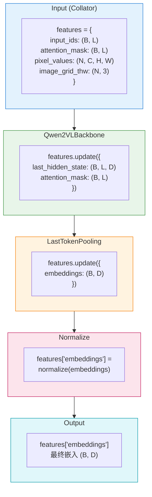

# 模块管道系统

> **版本**: 0.1
> **更新日期**: 2026-01-25
> **架构设计版本**: 1.0
> **参考**: sentence-transformers 模块设计

## 1. 设计理念

### 1.1 对标 sentence-transformers

BToks 的模块管道设计直接参考 [sentence-transformers](https://www.sbert.net/) 的架构：

- **模块组合**：模型由多个模块顺序组成
- **统一接口**：所有模块实现 `forward(features) -> features`
- **features 字典**：模块间通过字典传递数据，支持灵活扩展

### 1.2 核心优势

| 优势 | 说明 |
|------|------|
| **灵活组合** | 通过配置组合不同模块，无需修改代码 |
| **易于扩展** | 实现新模块只需继承基类并注册 |
| **配置驱动** | 不同方法通过配置切换 |
| **透明调试** | features 字典可在任意节点检查 |

---

## 2. 模块基类

### 2.1 Module 接口

所有管道模块实现统一的接口：

```python
import torch.nn as nn
from torch import Tensor

class Module(nn.Module):
    """模块基类 - 所有管道模块继承此类。

    Module base class - all pipeline modules inherit from this.
    """

    def forward(self, **features) -> dict[str, Tensor]:
        """处理 features 并返回更新后的 features。

        Process features and return updated features dict.

        Args:
            **features: 输入特征字典
                       Input features dictionary

        Returns:
            更新后的特征字典，包含新增/修改的键
            Updated features dict with new/modified keys
        """
        raise NotImplementedError

    @classmethod
    def from_config(cls, config: dict) -> "Module":
        """从配置字典创建模块。

        Create module from configuration dict.

        Args:
            config: 配置字典，包含 'type' 和模块参数
                   Config dict with 'type' and module parameters

        Returns:
            模块实例
            Module instance
        """
        config = config.copy()
        config.pop("type", None)  # 移除 type 键
        return cls(**config)
```

**设计原则**：所有模块遵循相同的 `forward(**features) -> dict` 接口，无需额外的扩展接口。

### 2.2 Processor 处理

BToks 遵循 **HuggingFace 标准模式**，Model 和 Processor 完全分离：

```python
from vlm2emb import BToks
from transformers import AutoProcessor

# Model 和 Processor 分别加载
model = BToks.from_pretrained("/path/to/local/checkpoint")
processor = AutoProcessor.from_pretrained("/path/to/local/checkpoint")

# 使用 processor 预处理输入
inputs = processor(text=["Hello"], images=[image], return_tensors="pt")

# 前向传播
outputs = model(**inputs)
embeddings = outputs["embeddings"]
```

**设计原则**：

| 方面 | 说明 |
|------|------|
| **HF 兼容** | 完全遵循 HuggingFace 的 Model/Processor 分离模式 |
| **职责分离** | Model 负责计算，Processor 负责预处理 |
| **独立保存** | `model.save_pretrained()` 和 `processor.save_pretrained()` 分别调用 |
| **灵活组合** | Processor 可独立替换，不影响模型 |

**保存与加载**：

```python
# 保存到同一目录（HF 标准模式）
model.save_pretrained("./my_model")
processor.save_pretrained("./my_model")

# 目录结构：
# ./my_model/
# ├── config.json              # 模型配置
# ├── model.safetensors        # 模型权重
# ├── preprocessor_config.json # Processor 配置
# ├── tokenizer_config.json    # Tokenizer 配置
# └── ...
```

---

## 3. Features Dict 标准键

模块间通过 `features` 字典传递数据。以下是标准键定义：

### 3.1 输入层键（由 Collator 提供）

| 键名 | 形状 | 说明 |
|------|------|------|
| `input_ids` | `(B, L)` | Token IDs |
| `attention_mask` | `(B, L)` | 注意力掩码，1=有效，0=填充 |
| `pixel_values` | `(N, C, H, W)` | 图像像素值 |
| `image_grid_thw` | `(N, 3)` | 图像网格维度 (Qwen2VL) |
| `pixel_values_videos` | `...` | 视频像素值 |
| `video_grid_thw` | `...` | 视频网格维度 |

### 3.2 中间层键（由 Backbone 输出）

| 键名 | 形状 | 说明 |
|------|------|------|
| `last_hidden_state` | `(B, L, D)` | Transformer 最后一层输出 |
| `hidden_states` | `tuple` | 所有层输出（可选） |

### 3.3 输出层键（由 Pooling/Normalize 输出）

| 键名 | 形状 | 说明 |
|------|------|------|
| `embeddings` | `(B, D)` | 池化后的嵌入向量 |

### 3.4 数据流示例



---

## 4. 内置模块详解

### 4.1 BackboneBase 基类

所有 Backbone 模块继承 `BackboneBase(nn.Module)` 抽象基类，用于类型标识（如 PEFT `modules_to_save` 推断时跳过 Backbone）。

```python
from vlm2emb.modules.backbone import BackboneBase

isinstance(backbone, BackboneBase)  # True
```

### 4.2 Qwen2VLBackbone

Qwen2-VL 骨干网络模块，封装 `Qwen2VLForConditionalGeneration`。

支持双模式 `from_config` 初始化：

| 模式 | 触发条件 | 行为 |
|------|----------|------|
| **加载模式** | 配置含 `model_name_or_path` | 调用 `from_pretrained` 加载预训练权重 |
| **结构模式** | 配置含 `backbone_config` | 仅创建模型结构，不加载权重（用于 `from_pretrained` 场景） |

> **说明**：
>
> - recipe config（训练/初始化配置）通常只提供 `model_name_or_path`
> - artifact config（`save_pretrained` 产物）在 reference 模式下会同时包含：
>   - `backbone_config`：用于 skeleton 构建
>   - `model_name_or_path`：用于单次 reference 重载

```python
from vlm2emb.modules import Qwen2VLBackbone

# 加载模式：从预训练加载（训练时使用）
backbone = Qwen2VLBackbone.from_config({
    "model_name_or_path": "Qwen/Qwen2-VL-7B-Instruct",
    "dtype": "bfloat16",
    "attn_implementation": "flash_attention_2",
})

# 结构模式：仅创建结构（from_pretrained 时自动使用）
backbone = Qwen2VLBackbone.from_config({
    "backbone_config": { ... },  # 序列化的模型配置
    "dtype": "bfloat16",
})
```

**配置示例**：
```yaml
modules:
  - type: Qwen2VLBackbone
    model_name_or_path: "Qwen/Qwen2-VL-7B-Instruct"
    dtype: bfloat16
    attn_implementation: flash_attention_2
    min_pixels: 200704   # 256 * 28 * 28
    max_pixels: 1003520  # 1280 * 28 * 28
```

**输入/输出**：

| 输入 | 输出 |
|------|------|
| `input_ids`, `attention_mask` | `last_hidden_state` |
| `pixel_values`, `image_grid_thw` | `attention_mask` (可能扩展) |
| `pixel_values_videos`, `video_grid_thw` | `hidden_states` (可选) |

### 4.2 LastTokenPooling

最后 token 池化，提取序列最后一个有效 token 的隐藏状态。这是 **VLM2Vec 的默认池化策略**。

```python
from vlm2emb.modules import LastTokenPooling

pooling = LastTokenPooling()

output = pooling(
    last_hidden_state=hidden,  # (B, L, D)
    attention_mask=mask,        # (B, L)
)
# output["embeddings"]: (B, D)
```

**工作原理**：
```python
def forward(self, last_hidden_state, attention_mask=None, **kwargs):
    batch_size, seq_len, hidden_size = last_hidden_state.shape

    if attention_mask is not None:
        # 检测填充方向
        left_padding = attention_mask[:, -1].sum() == batch_size

        if left_padding:
            # 左填充：直接取最后位置
            pooled = last_hidden_state[:, -1, :]
        else:
            # 右填充：找到每个样本的最后有效位置
            eos_indices = attention_mask.sum(dim=1).long() - 1
            pooled = last_hidden_state[
                torch.arange(batch_size, device=last_hidden_state.device),
                eos_indices,
            ]
    else:
        pooled = last_hidden_state[:, -1, :]

    return {"embeddings": pooled, **kwargs}
```

**配置示例**：
```yaml
modules:
  - type: LastTokenPooling
```

### 4.3 MeanPooling

均值池化，对所有有效 token 的隐藏状态取平均。

```python
from vlm2emb.modules import MeanPooling

pooling = MeanPooling()

output = pooling(
    last_hidden_state=hidden,  # (B, L, D)
    attention_mask=mask,        # (B, L)
)
# output["embeddings"]: (B, D)
```

**工作原理**：
```python
def forward(self, last_hidden_state, attention_mask=None, **kwargs):
    if attention_mask is not None:
        # 扩展 mask 到隐藏维度
        mask_expanded = attention_mask.unsqueeze(-1).expand(
            last_hidden_state.size()
        ).float()
        # 加权求和
        sum_hidden = (last_hidden_state * mask_expanded).sum(dim=1)
        sum_mask = mask_expanded.sum(dim=1)
        pooled = sum_hidden / sum_mask.clamp(min=1e-9)
    else:
        pooled = last_hidden_state.mean(dim=1)

    return {"embeddings": pooled, **kwargs}
```

**配置示例**：
```yaml
modules:
  - type: MeanPooling
```

### 4.4 Normalize

L2 归一化模块，将嵌入向量归一化到单位球面上。

```python
from vlm2emb.modules import Normalize

normalize = Normalize()

output = normalize(embeddings=emb)  # (B, D)
# output["embeddings"]: (B, D), L2-normalized
```

**工作原理**：
```python
def forward(self, embeddings, **kwargs):
    normalized = torch.nn.functional.normalize(embeddings, p=2, dim=-1)
    return {"embeddings": normalized, **kwargs}
```

**配置示例**：
```yaml
modules:
  - type: Normalize
```

---

## 5. 模块组合示例

### 5.1 VLM2Vec 配置

VLM2Vec 使用最后 token 池化 + L2 归一化：

```yaml
model:
  type: vlm2emb
  modules:
    - type: Qwen2VLBackbone
      model_name_or_path: "Qwen/Qwen2-VL-7B-Instruct"
      dtype: bfloat16
      attn_implementation: flash_attention_2

    - type: LastTokenPooling

    - type: Normalize
```

**数据流**：
```
Input → Qwen2VLBackbone → LastTokenPooling → Normalize → Embedding
```

### 5.2 BToks 配置

> **待设计**：BToks 配置方案正在重新设计中，敬请期待。

### 5.3 带 Dense 层的配置

添加线性投影层改变嵌入维度：

```yaml
model:
  type: vlm2emb
  modules:
    - type: Qwen2VLBackbone
      model_name_or_path: "Qwen/Qwen2-VL-7B-Instruct"

    - type: LastTokenPooling

    - type: Dense
      in_features: 3584    # Qwen2VL 隐藏维度
      out_features: 1024   # 目标嵌入维度
      activation: tanh

    - type: Normalize
```

---

## 6. 自定义模块开发

### 6.1 实现步骤

1. **继承 Module 基类**
2. **实现 forward() 方法**
3. **实现 from_config() 类方法**
4. **注册到 AutoModule**

### 6.2 完整示例

```python
import torch
import torch.nn as nn
from torch import Tensor
from vlm2emb.auto import AutoModule


@AutoModule.register("WeightedPooling")
class WeightedPooling(nn.Module):
    """加权池化模块。

    Weighted pooling module.

    根据可学习权重对 token 进行加权平均。
    Performs weighted average over tokens with learnable weights.
    """

    def __init__(self, hidden_size: int = 3584, **kwargs):
        """初始化加权池化。

        Initialize weighted pooling.

        Args:
            hidden_size: 隐藏层维度
                        Hidden dimension size
        """
        super().__init__()
        self.weight = nn.Parameter(torch.ones(hidden_size))

    @classmethod
    def from_config(cls, config: dict) -> "WeightedPooling":
        """从配置创建。

        Create from config.
        """
        config = config.copy()
        config.pop("type", None)
        return cls(**config)

    def forward(
        self,
        last_hidden_state: Tensor,
        attention_mask: Tensor | None = None,
        **kwargs,
    ) -> dict[str, Tensor]:
        """前向传播。

        Forward pass.

        Args:
            last_hidden_state: 隐藏状态 (B, L, D)
            attention_mask: 注意力掩码 (B, L)
            **kwargs: 透传参数

        Returns:
            包含 embeddings 的字典
        """
        # 应用可学习权重
        weighted = last_hidden_state * self.weight.unsqueeze(0).unsqueeze(0)

        if attention_mask is not None:
            mask = attention_mask.unsqueeze(-1).float()
            pooled = (weighted * mask).sum(dim=1) / mask.sum(dim=1).clamp(min=1e-9)
        else:
            pooled = weighted.mean(dim=1)

        return {
            "embeddings": pooled,
            "last_hidden_state": last_hidden_state,
            "attention_mask": attention_mask,
            **kwargs,
        }
```

### 6.3 使用自定义模块

```yaml
# configs/experiments/custom_pooling.yaml
model:
  type: vlm2emb
  modules:
    - type: Qwen2VLBackbone
      model_name_or_path: "Qwen/Qwen2-VL-7B-Instruct"

    - type: WeightedPooling
      hidden_size: 3584

    - type: Normalize
```

```python
# 确保模块被注册
import your_module  # 导入包含 WeightedPooling 的模块

from vlm2emb import create_model
from vlm2emb.config import load_config

config = load_config("configs/experiments/custom_pooling.yaml")
model = create_model(config)
```

---

## 7. 执行流程

### 7.1 训练时 forward 流程

```python
# BToks.forward()
def forward(self, input_ids, attention_mask, pixel_values, ...):
    # 1. 初始化 features 字典
    features = {
        "input_ids": input_ids,
        "attention_mask": attention_mask,
        "pixel_values": pixel_values,
        ...
    }

    # 2. 移除 None 值
    features = {k: v for k, v in features.items() if v is not None}

    # 3. 按顺序执行模块
    for module in self._modules_list:
        output = module(**features)
        features.update(output)

    # 4. 返回完整 features
    return features
```

### 7.2 推理流程

```python
import torch
from vlm2emb import BToks
from transformers import AutoProcessor

# 1. 分别加载 model 和 processor（遵循 HF 标准）
model = BToks.from_pretrained("/path/to/local/checkpoint")
processor = AutoProcessor.from_pretrained("/path/to/local/checkpoint")

# 2. 预处理
inputs = processor(
    text=["What is in this image?"],
    images=[image],
    return_tensors="pt"
)
inputs = {k: v.to(model.device) for k, v in inputs.items()}

# 3. 前向传播
with torch.no_grad():
    features = model(**inputs)

embeddings = features["embeddings"]
```

---

## 8. 注意事项

### 8.1 模块顺序

模块顺序不固定，可以根据需求自由组合，只要计算过程符合预期即可。常见的组合模式：

- **Backbone → Pooling → Normalize**：标准嵌入提取
- **Backbone → Pooling → Dense → Normalize**：带维度变换的嵌入
- **Backbone → 自定义模块 → Pooling → Normalize**：插入自定义处理

### 8.2 features 键命名

- 使用标准键名以确保兼容性
- 新增键应有清晰的语义
- 避免覆盖必需的键

### 8.3 性能考虑

- 避免在 forward 中进行不必要的数据复制
- 使用 `**kwargs` 透传不使用的参数
- 保持模块轻量

---

## 9. 相关文档

- [架构总览](./overview.md) - 整体架构
- [注册表系统](./registry-system.md) - AutoModule 详解
- [BToks API](../api/model.md) - 模型 API 参考
