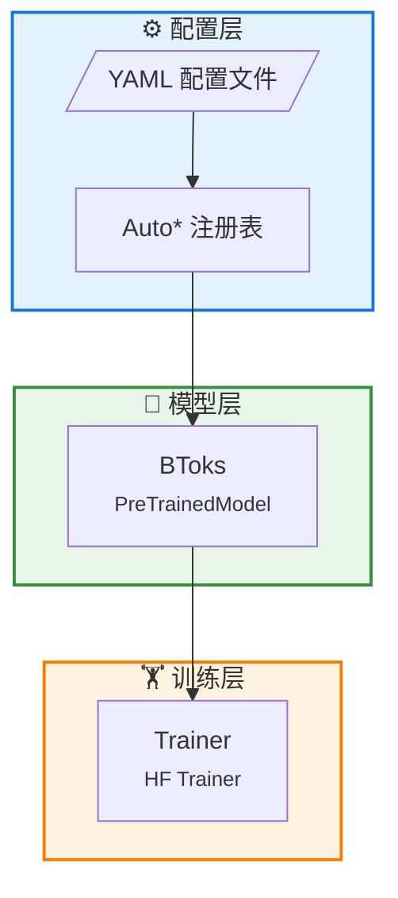
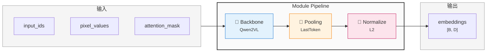
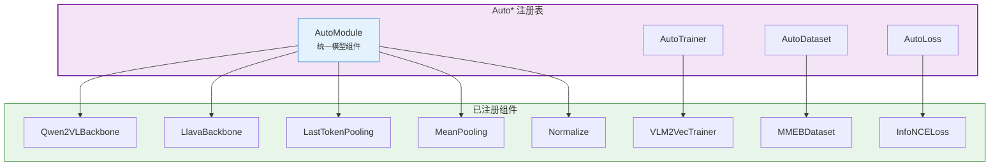

# BToks 架构总览

> **版本**: 0.1
> **更新日期**: 2026-01-25
> **状态**: 实现中
> **架构设计版本**: 1.0

## 1. 设计哲学

BToks 的架构设计遵循以下核心原则：

### 1.1 配置驱动，代码最小化

- **YAML 配置控制一切**：模型结构、训练参数、数据流程均通过配置文件定义
- **零代码切换**：通过修改配置即可切换不同的模型变体（VLM2Vec、BToks）
- **继承与复用**：配置支持 `_inherit_` 指令，实现层级继承

📖 **详细文档**：[配置系统](./config-system.md)

### 1.2 模块化管道，组件可替换

- **Pipeline 架构**：模型由一系列模块顺序组成，模块间通过 `features` 字典通信
- **注册表驱动**：所有组件通过注册表管理，支持动态发现和替换
- **接口一致性**：所有模块遵循统一的 `forward(features) -> features` 模式

📖 **详细文档**：[模块管道系统](./module-pipeline.md) | [注册表系统](./registry-system.md)

### 1.3 对标成熟框架

- **sentence-transformers**：模块管道设计、features 字典传递
- **HuggingFace Transformers**：继承 `PreTrainedModel`/`PretrainedConfig`，支持 `from_pretrained()`

📖 **详细文档**：[BToks API](../api/model.md) | [训练系统](./training-system.md)

---

## 2. 系统架构

### 2.1 系统总览

BToks 采用三层架构，从配置到训练形成清晰的数据流：



### 2.2 模型管道架构

BToks 内部采用模块化管道设计，每个模块处理 `features` 字典并传递给下一个：



**数据流详解**：

| 阶段 | 模块 | 输入 | 输出 |
|------|------|------|------|
| 1 | Backbone | `input_ids`, `pixel_values`, `attention_mask` | `+ last_hidden_state` |
| 2 | Pooling | `last_hidden_state`, `attention_mask` | `+ embeddings` |
| 3 | Normalize | `embeddings` | `embeddings` (归一化) |

### 2.3 注册表系统

所有组件通过 `Auto*` 注册表统一管理，支持配置驱动的动态实例化：



**使用方式**：

```python
from vlm2emb import AutoModule

# 从配置实例化（推荐）
backbone = AutoModule.from_config({"type": "Qwen2VLBackbone", "model_name_or_path": "..."})
pooling = AutoModule.from_config({"type": "LastTokenPooling"})

# 直接构建
normalize = AutoModule.build("Normalize")

# 列出所有可用模块
print(AutoModule.list_modules())
```

---

## 3. 核心抽象

### 3.1 BToksConfig

继承自 `VLM2EmbConfig`，是 BToks 模型的主要配置类。当前代码库仍使用
`vlm2emb` 作为公开 Python import namespace。

```python
from vlm2emb import BToksConfig

config = BToksConfig(
    modules=[
        {"type": "Qwen2VLBackbone", "model_name_or_path": "Qwen/Qwen2-VL-7B-Instruct"},
        {"type": "LastTokenPooling"},
        {"type": "Normalize"},  # 通过添加/移除此模块控制是否归一化
    ],
)
```

**关键属性**：
- `modules`: 模块配置列表，定义管道结构
- `model_type`: 固定为 `"btoks"`

**归一化控制**：通过在 `modules` 列表中添加或移除 `Normalize` 模块来控制是否归一化输出。

### 3.2 BToks

继承自 `transformers.PreTrainedModel`，核心模型类。

```python
from vlm2emb import BToks, create_model

# 方式 1: 从配置创建
model = create_model(config)

# 方式 2: 从预训练加载
model = BToks.from_pretrained("public-model-or-checkpoint")

# 推理: 使用 forward() + 预处理
inputs = processor(text=["query"], images=[pil_image], return_tensors="pt")
inputs = {k: v.to(model.device) for k, v in inputs.items()}
features = model(**inputs)
embeddings = features["embeddings"]

# 训练 forward
features = model(input_ids=tokens, attention_mask=mask, pixel_values=images)
```

**核心方法**：
- `forward()`: 训练和推理的前向传播，返回 features 字典
- `similarity()`: 已移除，由用户自行实现

### 3.3 Trainer

继承自 `transformers.Trainer`，扩展嵌入训练支持。

```python
from vlm2emb.training import Trainer
from transformers import TrainingArguments

args = TrainingArguments(
    output_dir="./output",
    per_device_train_batch_size=8,
    learning_rate=1e-5,
)

trainer = Trainer(
    model=model,
    args=args,
    train_dataset=dataset,
    data_collator=collator,
)

trainer.train()
```

**扩展功能**：
- 自定义 `compute_loss()` 支持对比学习
- `ChunkSampler` 支持交错数据集
- 内置分布式对比损失

### 3.4 Module

所有管道模块直接继承 `nn.Module`，遵循统一的 `forward` 接口约定：

```python
import torch.nn as nn

class MyModule(nn.Module):
    def forward(self, **features) -> dict[str, Tensor]:
        """处理 features 并返回新增/修改的键值"""
        # 从 features 获取输入
        hidden_state = features["last_hidden_state"]

        # 处理...
        result = self.process(hidden_state)

        # 返回新增或修改的键值（框架会自动合并到 features）
        return {"embeddings": result}
```

**接口约定**：

- 输入：`**features` 字典（包含前序模块的输出）
- 输出：可以返回完整的 `features` 字典，也可以只返回新增或修改的键值对
- 无需继承特定基类，只需遵循此约定

**内置模块**：

| 模块 | 类型 | 说明 |
|------|------|------|
| `Qwen2VLBackbone` | Backbone | Qwen2-VL 骨干网络 |
| `LastTokenPooling` | Pooling | 最后 token 池化 (VLM2Vec) |
| `MeanPooling` | Pooling | 均值池化 |
| `Normalize` | Transform | L2 归一化 |

---

## 4. 技术栈

| 组件 | 技术选型 | 版本要求 |
|------|----------|----------|
| **语言** | Python | ≥3.11 |
| **ML 框架** | PyTorch | ≥2.0.0 |
| **模型库** | Transformers | ≥4.37.0 |
| **配置系统** | OmegaConf | ≥2.3.0 |
| **分布式** | DeepSpeed | ≥0.12.0 |
| **PEFT** | PEFT | ≥0.7.0 |
| **代码质量** | Ruff | ≥0.1.0 |
| **测试** | pytest | ≥7.0 |

---

## 5. 项目结构

```
src/vlm2emb/
├── __init__.py              # 公开 API 导出
├── model.py                 # BToks, VLM2EmbConfig, create_model
├── config.py                # 配置加载器 (OmegaConf)
├── registry.py              # Registry 基类
├── auto.py                  # Auto* 注册表实例
├── exceptions.py            # 异常定义
│
├── modules/                 # 管道模块
│   ├── backbone.py          # Qwen2VLBackbone
│   └── pooling.py           # LastTokenPooling, MeanPooling, Normalize
│
├── training/                # 训练框架
│   ├── trainer.py           # Trainer (继承 HF Trainer)
│   ├── losses/              # 损失函数
│   └── grad_cache/          # 梯度缓存
│
├── data/                    # 数据流程
│   ├── datasets/            # 数据集实现
│   ├── collators/           # 批次整理器
│   └── preprocessing/       # 预处理工具
│
└── evaluation/              # 评估模块
    ├── metrics.py           # 评估指标
    └── eval_dataset.py      # 评估数据集
```

---

## 6. 快速开始

### 6.1 安装

```bash
pip install vlm2emb
```

### 6.2 推理

```python
import torch
from vlm2emb import BToks
from transformers import AutoProcessor

# 加载预训练模型和 processor（遵循 HF 标准）
model = BToks.from_pretrained("public-model-or-checkpoint")
processor = AutoProcessor.from_pretrained("public-model-or-checkpoint")

# 预处理
inputs = processor(
    text=["What is in this image?"],
    images=[pil_image],
    return_tensors="pt"
)
inputs = {k: v.to(model.device) for k, v in inputs.items()}

# 前向传播获取嵌入
with torch.no_grad():
    features = model(**inputs)

embeddings = features["embeddings"]

# 后续处理（相似度计算等）由用户自行实现
```

### 6.3 训练

```python
from vlm2emb import create_model
from vlm2emb.config import load_config
from vlm2emb.training import Trainer

# 加载配置
config = load_config("configs/presets/vlm2vec_qwen2vl_2b.yaml")

# 创建模型
model = create_model(config)

# 训练
trainer = Trainer(model=model, args=args, train_dataset=dataset)
trainer.train()
```

---

## 7. 相关文档

- [模块管道系统](./module-pipeline.md) - 模块设计详解
- [注册表系统](./registry-system.md) - 组件注册机制
- [配置系统](./config-system.md) - YAML 配置详解
- [训练系统](./training-system.md) - 训练器设计
- [API 参考](../api/model.md) - BToks API
