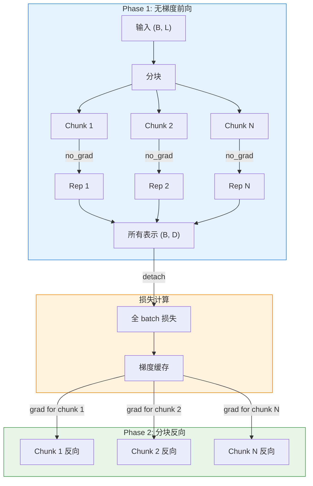

# 训练系统

> **版本**: 0.1
> **更新日期**: 2026-01-25
> **架构设计版本**: 1.0
> **参考**: HuggingFace Trainer, GradCache

## 1. 设计理念

### 1.1 继承 HuggingFace Trainer

BToks 的训练系统直接继承 HuggingFace Trainer，最大化复用成熟的训练基础设施：

| 优势 | 说明 |
|------|------|
| **生态兼容** | 无缝集成 HuggingFace 生态（Accelerate、DeepSpeed、FSDP） |
| **功能完备** | 自动获得检查点、日志、评估等功能 |
| **最小侵入** | 仅重写必要方法（`compute_loss`、`training_step`） |
| **易于扩展** | 通过继承添加新功能 |

### 1.2 训练器层次结构

```
HuggingFace Trainer
        │
        ▼
    Trainer (vlm2emb)
        │  - 基础对比学习支持
        │  - (query, positive) 对训练
        │  - 分布式损失函数
        │
        ▼
  VLM2VecTrainer
        │  - GradCache 支持
        │  - VLM2Vec 特定参数
        │  - 大批量训练优化
        │
        ▼
   BToksTrainer 等
```

---

## 2. Trainer 架构

### 2.1 基础 Trainer

`Trainer` 类扩展 HuggingFace Trainer，支持嵌入模型的对比学习：

```python
from vlm2emb.training import Trainer
from transformers import TrainingArguments

args = TrainingArguments(
    output_dir="./output",
    per_device_train_batch_size=8,
    learning_rate=1e-5,
    num_train_epochs=3,
    bf16=True,
)

trainer = Trainer(
    model=model,
    args=args,
    train_dataset=dataset,
    data_collator=collator,
)

trainer.train()
```

### 2.2 核心方法重写

#### compute_loss()

处理 `(query, positive)` 对的对比损失计算：

```python
def compute_loss(
    self,
    model: nn.Module,
    inputs: dict[str, dict],
    return_outputs: bool = False,
    num_items_in_batch: int | None = None,
) -> Tensor | tuple[Tensor, Any]:
    """计算 (qry, pos) 对的对比损失。

    Args:
        model: 模型
        inputs: 包含 "query", "positive", "metadata" 键的字典
        return_outputs: 是否返回模型输出
        num_items_in_batch: batch 中的样本数（未使用）

    Returns:
        损失张量，可选地包含输出
    """
    # 提取输入
    qry_inputs = inputs["query"]
    pos_inputs = inputs["positive"]

    # 移除 metadata（模型不需要）
    qry_inputs = {k: v for k, v in qry_inputs.items() if k != "metadata"}
    pos_inputs = {k: v for k, v in pos_inputs.items() if k != "metadata"}

    # 前向传播
    qry_outputs = model(**qry_inputs)
    pos_outputs = model(**pos_inputs)

    qry_embeds = qry_outputs["embeddings"]
    pos_embeds = pos_outputs["embeddings"]

    # 计算对比损失
    loss = self.loss_fn(qry_embeds, pos_embeds)

    if return_outputs:
        return loss, {"qry_embeds": qry_embeds, "pos_embeds": pos_embeds}
    return loss
```

#### _setup_loss_fn()

根据分布式环境自动选择损失函数：

```python
def _setup_loss_fn(self) -> None:
    """设置对比损失函数。"""
    from vlm2emb.training.losses.contrastive import (
        ContrastiveLoss,
        DistributedContrastiveLoss,
    )

    if self.accelerator.use_distributed:
        self.loss_fn = DistributedContrastiveLoss(temperature=self.args.temperature)
    else:
        self.loss_fn = ContrastiveLoss(temperature=self.args.temperature)
```

### 2.3 输入数据格式

Trainer 期望的输入格式（由 Collator 提供）：

```python
inputs = {
    "query": {
        "input_ids": Tensor,        # (B, L_q)
        "attention_mask": Tensor,   # (B, L_q)
        "pixel_values": Tensor,     # (N_q, C, H, W)
        "image_grid_thw": Tensor,   # (N_q, 3)
    },
    "positive": {
        "input_ids": Tensor,        # (B, L_p)
        "attention_mask": Tensor,   # (B, L_p)
        "pixel_values": Tensor,     # (N_p, C, H, W)
        "image_grid_thw": Tensor,   # (N_p, 3)
    },
    "metadata": [                   # 可选，用于调试
        {"dataset_name": "mmeb", "task": "retrieval"},
        ...
    ],
}
```

### 2.4 BToks 生成辅助协议

BToks 的 generation loss 不会复用 embedding 主路径的原始输入模板，而是在 trainer 内部为 opposite 目标追加一个显式的生成协议头尾：

```text
<|im_start|>assistant
{target}
<|im_end|>
```

实现要点：

- `generation_prefix_text` 默认是 `"<|im_start|>assistant\n"`
- `generation_suffix_text` 默认是 `"<|im_end|>"`
- prefix header 本身始终不会参与 generation loss
- suffix 是否参与 generation loss 由 `include_generation_suffix_in_loss` 控制
- `generation_kv_mode` 默认是 `"compressed"`，表示 generation loss 使用压缩 KV cache

这样做有两个目的：

1. 让第一个正文 token 有稳定的前文可预测，避免“首 token 无 loss”的问题
2. 让训练协议与后续 `btoks cache -> assistant span` 的推理协议保持一致

BToks ablation 支持两个正交开关：

| `model.modules.injector.num_tokens` | `train.args.generation_kv_mode` | embedding 来源 | generation KV 来源 |
|-------------------------------------|--------------------------------|----------------|--------------------|
| `> 0` | `"compressed"` | btoks token pooling | btoks token KV |
| `> 0` | `"full"` | btoks token pooling | 完整 KV cache |
| `0` | `"compressed"` | 最后一个有效 token | 最后一个有效 token KV |
| `0` | `"full"` | 最后一个有效 token | 完整 KV cache |

当 `num_tokens=0` 时，`BToksTokenInjector` 不注册或追加额外 token；`BToksPooling` 使用 `attention_mask` 中最后一个非零位置的 hidden state。若没有 `attention_mask`，则退化为序列末位。

这些组合不需要专用 preset，可以直接在训练命令末尾追加 dotlist override：

```bash
python scripts/train.py configs/presets/btoks_qwen2vl_2b_v1.yaml \
    model.modules.injector.num_tokens=0

python scripts/train.py configs/presets/btoks_qwen2vl_2b_v1.yaml \
    train.args.generation_kv_mode=full

python scripts/train.py configs/presets/btoks_qwen2vl_2b_v1.yaml \
    model.modules.injector.num_tokens=0 \
    train.args.generation_kv_mode=full
```

另外，Qwen processor wrapper 现在会在 processor 层把视觉占位规范为官方边界格式，例如：

```text
<|vision_start|><|image_pad|><|vision_end|>
<|vision_start|><|video_pad|><|vision_end|>
```

这一步属于 processor 的输入规范职责，不在数据层完成。

---

## 3. PEFT / LoRA 集成

### 3.1 apply_peft

PEFT 应用通过 `training/train.py` 中的 `apply_peft` 函数集中管理，保持 BToks 模型纯净：

```python
from vlm2emb.training.train import apply_peft

model = apply_peft(model, {
    "type": "lora",
    "r": 16,
    "alpha": 64,
    "target_modules": "q_proj,k_proj,v_proj,o_proj",
    "dropout": 0.1,
    "use_dora": True,
})
```

### 3.2 modules_to_save 自动推断

`apply_peft` 自动推断 `modules_to_save`（除非用户显式指定）。推断逻辑 (`_infer_modules_to_save`)：

| 模块类型 | 处理方式 |
|----------|----------|
| `BackboneBase` 子类 | 跳过（LoRA 通过 `target_modules` 处理） |
| 零参数模块（Pooling, Normalize） | 跳过 |
| 其他有参数模块（如 BottleneckTokens） | 加入 `modules_to_save` |

```python
# 自动推断示例
# BToks: [Qwen2VLBackbone, BottleneckTokens, LastTokenPooling, Normalize]
# → modules_to_save = ["_modules_list.1"]  (BottleneckTokens)
```

### 3.3 两步加载（Adapter 恢复）

从保存的 adapter 恢复训练或推理：

```python
from vlm2emb import create_model, BToks
from peft import PeftModel

# 方式 1: 从 YAML 配置重建
base_model = create_model(yaml_config)
model = PeftModel.from_pretrained(base_model, adapter_path)

# 方式 2: 从已保存的 base model
base_model = BToks.from_pretrained(base_model_path)
model = PeftModel.from_pretrained(base_model, adapter_path)
```

### 3.4 合并与导出

```python
# 合并 adapter 到 base model 并保存全量模型
merged = model.merge_and_unload()
merged.save_pretrained("./merged_model")
```

---

## 4. VLM2VecTrainer

### 4.1 扩展功能

`VLM2VecTrainer` 在基础 Trainer 上添加：

| 功能 | 说明 |
|------|------|
| **GradCache** | 内存高效的大批量训练 |
| **VLM2Vec 参数** | temperature、max_length 等 |
| **BatchInterleaveSampler** | 交错数据集的采样支持 |

### 4.2 VLM2VecTrainingArgs

```python
from vlm2emb.training.trainers import VLM2VecTrainingArgs

args = VLM2VecTrainingArgs(
    output_dir="./output",
    per_device_train_batch_size=8,

    # VLM2Vec 特定参数
    temperature=0.02,           # 对比损失温度
    max_length=512,             # 最大序列长度

    # GradCache 参数
    use_grad_cache=True,        # 启用 GradCache
    gc_q_chunk_size=4,          # Query 块大小
    gc_p_chunk_size=4,          # Passage 块大小

    # 交错数据集采样
    interleave_batch_size=8,    # BatchInterleaveSampler 批次大小
    interleave_stopping_strategy="all_exhausted",
    interleave_shuffle_within_dataset=False,
)
```

### 4.3 使用示例

```python
from vlm2emb.training.trainers import VLM2VecTrainer, VLM2VecTrainingArgs

args = VLM2VecTrainingArgs(
    output_dir="./output",
    per_device_train_batch_size=8,
    temperature=0.02,
    use_grad_cache=True,
    gc_q_chunk_size=4,
    gc_p_chunk_size=4,
    bf16=True,
)

trainer = VLM2VecTrainer(
    model=model,
    args=args,
    train_dataset=dataset,
    data_collator=collator,
)

trainer.train()
```

---

## 5. 损失函数

### 5.1 ContrastiveLoss

基础 InfoNCE 对比损失：

```python
from vlm2emb.training.losses import ContrastiveLoss

loss_fn = ContrastiveLoss(temperature=0.02)

# 计算损失
loss = loss_fn(query_embeds, positive_embeds)
```

**实现原理**：

```python
class ContrastiveLoss(nn.Module):
    """InfoNCE 对比损失。

    对于 batch 中的每个 query，其对应的 positive 为正样本，
    其他所有 positive 为负样本。
    """

    def __init__(self, temperature: float = 0.02):
        super().__init__()
        self.temperature = temperature
        self.cross_entropy = nn.CrossEntropyLoss()

    def forward(self, query: Tensor, positive: Tensor) -> Tensor:
        """计算 InfoNCE 损失。

        Args:
            query: Query 嵌入 (B, D)
            positive: Positive 嵌入 (B, D)

        Returns:
            标量损失
        """
        # 计算相似度矩阵
        scores = torch.matmul(query, positive.T) / self.temperature  # (B, B)

        # 对角线为正样本
        labels = torch.arange(scores.size(0), device=scores.device)

        return self.cross_entropy(scores, labels)
```

### 5.2 DistributedContrastiveLoss

分布式训练的对比损失，跨 GPU 收集所有嵌入：

```python
from vlm2emb.training.losses import DistributedContrastiveLoss

loss_fn = DistributedContrastiveLoss(
    temperature=0.02,
    scale_loss=True,  # 按 world_size 缩放损失
)
```

**实现原理**：

```python
class DistributedContrastiveLoss(nn.Module):
    """分布式对比损失。

    使用 all_gather 收集所有 GPU 的嵌入，
    在全局 batch 上计算对比损失。
    """

    def forward(self, query: Tensor, positive: Tensor) -> Tensor:
        # 收集所有 GPU 的嵌入（保留梯度）
        all_query = self._gather_with_grad(query)      # (B*W, D)
        all_positive = self._gather_with_grad(positive)  # (B*W, D)

        # 计算全局相似度矩阵
        scores = torch.matmul(all_query, all_positive.T) / self.temperature

        # 计算当前 rank 的标签偏移
        rank = dist.get_rank()
        batch_size = query.size(0)
        labels = torch.arange(batch_size, device=query.device) + rank * batch_size

        return self.cross_entropy(scores, labels)

    def _gather_with_grad(self, tensor: Tensor) -> Tensor:
        """收集张量并保留梯度。"""
        gathered = [torch.zeros_like(tensor) for _ in range(dist.get_world_size())]
        dist.all_gather(gathered, tensor)

        # 替换当前 rank 的张量以保留梯度
        gathered[dist.get_rank()] = tensor
        return torch.cat(gathered, dim=0)
```

### 5.3 InBatchContrastiveLoss

用于分类风格任务的对比损失：

```python
from vlm2emb.training.losses import InBatchContrastiveLoss

loss_fn = InBatchContrastiveLoss(temperature=0.02)

# 支持多个正样本
loss = loss_fn(query_embeds, positive_embeds, labels)
```

---

## 6. GradCache

### 6.1 设计动机

对比学习需要大 batch size 以获得足够的负样本。但大 batch 会导致显存不足。GradCache 通过两阶段计算解决此问题：

| 阶段 | 操作 | 显存使用 |
|------|------|----------|
| **Phase 1** | 无梯度前向，获取所有表示 | 低（无计算图） |
| **Phase 2** | 分块前向+立即反向 | 低（每次只处理一块） |

### 6.2 工作原理



### 6.3 函数式 API

BToks 使用函数式 `grad_cache_accumulate` API：

```python
from vlm2emb.training.grad_cache import grad_cache_accumulate

loss = grad_cache_accumulate(
    inputs=[qry_inputs, pos_inputs],      # 输入列表
    forward_fns=[forward_fn, forward_fn],  # 前向函数列表
    loss_fn=loss_fn,                       # 损失函数
    chunk_sizes=[4, 4],                    # 块大小
    backward_fn=backward_fn,               # 反向传播函数
    fp16=False,                            # 是否使用 FP16
)
```

### 6.4 实现细节

```python
def grad_cache_accumulate(
    inputs: list[dict],
    forward_fns: list[Callable],
    loss_fn: Callable,
    chunk_sizes: list[int],
    backward_fn: Callable | None = None,
    fp16: bool = False,
) -> Tensor:
    """GradCache 梯度累积。

    Args:
        inputs: 输入字典列表 [qry_inputs, pos_inputs]
        forward_fns: 前向函数列表
        loss_fn: 损失函数 (qry_reps, pos_reps) -> loss
        chunk_sizes: 每个输入的块大小
        backward_fn: 自定义反向传播函数
        fp16: 是否使用 FP16

    Returns:
        损失值（已 detach）
    """
    # Phase 1: 无梯度前向，收集所有表示
    all_reps = []
    for inp, forward_fn, chunk_size in zip(inputs, forward_fns, chunk_sizes):
        chunks = split_into_chunks(inp, chunk_size)
        reps = []
        for chunk in chunks:
            with torch.no_grad():
                rep = forward_fn(chunk)
            reps.append(rep)
        all_reps.append(torch.cat(reps, dim=0))

    # 计算全 batch 损失并构建梯度缓存
    all_reps_with_grad = [r.requires_grad_(True) for r in all_reps]
    loss = loss_fn(*all_reps_with_grad)
    loss.backward()

    # 保存梯度缓存
    grad_cache = [r.grad for r in all_reps_with_grad]

    # Phase 2: 分块前向+反向
    for i, (inp, forward_fn, chunk_size) in enumerate(zip(inputs, forward_fns, chunk_sizes)):
        chunks = split_into_chunks(inp, chunk_size)
        grad_chunks = split_into_chunks(grad_cache[i], chunk_size)

        for j, (chunk, grad_chunk) in enumerate(zip(chunks, grad_chunks)):
            rep = forward_fn(chunk)
            # 使用缓存的梯度进行反向传播
            surrogate = torch.dot(rep.flatten(), grad_chunk.flatten())

            is_last = (i == len(inputs) - 1) and (j == len(chunks) - 1)
            if backward_fn:
                backward_fn(surrogate, is_last)
            else:
                surrogate.backward()

    return loss.detach()
```

### 6.5 配置示例

```yaml
# configs/presets/vlm2vec_grad_cache.yaml
trainer:
  type: vlm2vec_trainer

training_args:
  type: vlm2vec
  output_dir: ./output
  per_device_train_batch_size: 8
  learning_rate: 1e-5
  num_train_epochs: 3
  bf16: true

  # GradCache 配置
  use_grad_cache: true
  gc_q_chunk_size: 4
  gc_p_chunk_size: 4

  # 对比学习参数
  temperature: 0.02
```

---

## 7. 分布式训练

### 7.1 Accelerate 集成

BToks 通过 HuggingFace Accelerate 支持分布式训练：

```yaml
# 保存在仓库外的 Accelerate 配置示例
compute_environment: LOCAL_MACHINE
distributed_type: MULTI_GPU
num_processes: 8
mixed_precision: bf16
```

启动训练：

```bash
accelerate launch \
    scripts/train.py configs/presets/vlm2vec_qwen2vl_2b.yaml
```

### 7.2 DeepSpeed 集成

支持 DeepSpeed ZeRO 优化：

```yaml
# 保存在仓库外的 DeepSpeed Accelerate 配置示例
compute_environment: LOCAL_MACHINE
distributed_type: DEEPSPEED
deepspeed_config:
  zero_optimization:
    stage: 2
    offload_optimizer:
      device: cpu
  bf16:
    enabled: true
```

### 7.3 分布式损失同步

在分布式训练中，`DistributedContrastiveLoss` 自动处理跨 GPU 的嵌入收集：

```python
# 自动选择损失函数
if self.accelerator.use_distributed:
    self.loss_fn = DistributedContrastiveLoss(temperature=0.02)
else:
    self.loss_fn = ContrastiveLoss(temperature=0.02)
```

### 7.4 梯度同步控制

GradCache 模式下，非最后一个 chunk 跳过梯度同步以提高效率：

```python
def backward_fn(tensor: Tensor, is_last_backward: bool) -> None:
    if is_last_backward:
        # 最后一个 chunk：同步梯度
        self.accelerator.backward(tensor)
    else:
        # 非最后 chunk：跳过同步
        with self.accelerator.no_sync(model):
            self.accelerator.backward(tensor)
```

---

## 8. 检查点管理

### 8.1 自动保存

继承 HuggingFace Trainer 的检查点功能：

```yaml
training_args:
  output_dir: ./output
  save_strategy: steps
  save_steps: 500
  save_total_limit: 3  # 最多保留 3 个检查点
```

### 8.2 检查点结构

```
output/
├── checkpoint-500/
│   ├── config.json           # 模型配置
│   ├── model.safetensors     # 模型权重
│   ├── optimizer.pt          # 优化器状态
│   ├── scheduler.pt          # 学习率调度器状态
│   ├── trainer_state.json    # 训练状态
│   └── train.args.bin     # 训练参数
├── checkpoint-1000/
│   └── ...
└── checkpoint-1500/
    └── ...
```

### 8.3 恢复训练

```python
trainer = VLM2VecTrainer(
    model=model,
    args=args,
    train_dataset=dataset,
    data_collator=collator,
)

# 从检查点恢复
trainer.train(resume_from_checkpoint="./output/checkpoint-500")
```

或通过命令行：

```bash
accelerate launch scripts/train.py \
    configs/presets/vlm2vec_qwen2vl_2b.yaml \
    train.args.resume_from_checkpoint=./output/checkpoint-500
```

### 8.4 最终模型保存

训练完成后保存最终模型：

```python
# 保存模型（遵循 HF 标准）
model.save_pretrained("./final_model")
processor.save_pretrained("./final_model")

# 或上传到 Hub
model.push_to_hub("public-model-or-checkpoint")
processor.push_to_hub("public-model-or-checkpoint")
```

---

## 9. 采样器

### 9.1 BatchInterleaveSampler

用于交错数据集的采样器，确保连续样本保持在一起：

```python
from vlm2emb.training.samplers import BatchInterleaveSampler

sampler = BatchInterleaveSampler(
    dataset,
    batch_size=8,               # 批次大小
    stopping_strategy="all_exhausted",  # 停止策略
    shuffle_within_dataset=True,  # 是否打乱子数据集内部样本
    seed=42,                    # 随机种子
)
```

**使用场景**：当使用多数据源混合训练时，需要保持同一数据集的样本在一起。

### 9.2 配置示例

```yaml
training_args:
  interleave_batch_size: 8                    # 启用 BatchInterleaveSampler
  interleave_stopping_strategy: all_exhausted # 停止策略
  interleave_shuffle_within_dataset: false    # 子数据集内部顺序读取
```

---

## 10. 注册表集成

### 10.1 Trainer 注册

```python
from vlm2emb.auto import AutoTrainer

# 注册自定义 Trainer
@AutoTrainer.register("my_trainer")
class MyTrainer(Trainer):
    pass

# 从配置创建
trainer = AutoTrainer.from_config(
    {"type": "vlm2vec_trainer"},
    model=model,
    args=training_args,
    train_dataset=dataset,
    data_collator=collator,
)
```

### 10.2 TrainingArgs 注册

```python
from vlm2emb.auto import AutoTrainingArgs

# 注册自定义 TrainingArgs
@AutoTrainingArgs.register("my_args")
@dataclass
class MyTrainingArgs(TrainingArguments):
    custom_param: float = 0.1

# 从配置创建
args = AutoTrainingArgs.from_config({
    "type": "my_args",
    "output_dir": "./output",
    "custom_param": 0.2,
})
```

---

## 11. 完整训练示例

### 11.1 YAML 配置

```yaml
# configs/presets/vlm2vec_qwen2vl_2b.yaml
model:
  _inherit_: ../models/vlm2vec.yaml

peft:
  type: lora
  r: 16
  alpha: 32
  target_modules: "qkv_proj,o_proj,gate_up_proj,down_proj,k_proj,q_proj,out_proj,v_proj"
  dropout: 0.05
  use_dora: false

data:
  train:
    dataset:
      type: combined
      datasets:
        _inherit_: ../datasets/mmeb_train.yaml
    collator:
      type: training

trainer:
  type: vlm2vec_trainer

training_args:
  type: vlm2vec
  output_dir: ./output/vlm2vec
  per_device_train_batch_size: 8
  learning_rate: 1e-5
  num_train_epochs: 1
  bf16: true
  temperature: 0.02
  use_grad_cache: true
  gc_q_chunk_size: 4
  gc_p_chunk_size: 4
```

### 11.2 训练脚本

```python
# scripts/train.py
from vlm2emb import train
from vlm2emb.config import load_config, apply_overrides

def main():
    # 加载配置
    config = load_config("configs/presets/vlm2vec_qwen2vl_2b.yaml")

    # 可选：应用 CLI 覆盖
    # config = apply_overrides(config, ["train.args.learning_rate=1e-4"])

    # 训练（所有逻辑在 src/ 中）
    train(config)

if __name__ == "__main__":
    main()
```

### 11.3 启动命令

```bash
# 单 GPU
python scripts/train.py configs/presets/vlm2vec_qwen2vl_2b.yaml

# 带覆盖参数
python scripts/train.py configs/presets/vlm2vec_qwen2vl_2b.yaml \
    train.args.learning_rate=1e-4

# 多 GPU（Accelerate）
accelerate launch \
    scripts/train.py configs/presets/vlm2vec_qwen2vl_2b.yaml

# DeepSpeed
accelerate launch \
    scripts/train.py configs/presets/vlm2vec_qwen2vl_2b.yaml
```

---

## 12. 相关文档

- [架构总览](./overview.md) - 整体架构设计
- [模块管道系统](./module-pipeline.md) - 模型模块设计
- [配置系统](./config-system.md) - YAML 配置详解
- [数据流程](../datasets/architecture-data-pipeline.md) - 数据集和 Collator
- [Trainer API](../api/trainer.md) - Trainer API 参考
