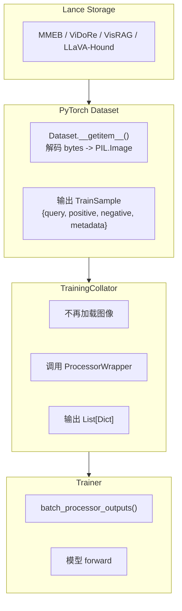

# 数据处理流水线

本文档描述当前 BToks 训练数据从 Lance 存储到模型输入的实际流水线。

> 相关规范：
> - [格式规范](./format-spec.md)
> - [自定义数据集开发指南](./guide-custom-dataset.md)

## 1. 当前训练流水线



核心变化：
- 图像/帧在 `Dataset.__getitem__()` 中解码，不再由 Collator 负责加载。
- 已迁移训练侧统一输出 `TrainSample`，每个 side 是 `MultiModalInput = {"text", "media"}`。
- Lance storage 不要求统一训练字段 schema；conversion 保留源字段和必要派生媒体，runtime Dataset 负责解释 layout 并构造 `TrainSample`。
- 训练侧允许 token / whitespace 归一化，但不改写 prompt wording。

## 2. 统一训练输出

定义见 `src/vlm2emb/data/schema.py`：

```python
class MediaInput(TypedDict, total=False):
    kind: str
    content: Any
    metadata: dict[str, Any]


class MultiModalInput(TypedDict):
    text: str
    media: list[MediaInput]


class TrainSample(TypedDict, total=False):
    query: MultiModalInput
    positive: MultiModalInput
    negative: MultiModalInput
    metadata: dict[str, Any]
```

约束：
- `MultiModalInput` 只保留模型输入必需字段：`text` 与 `media`
- `media` 属于每个 side 的 `MultiModalInput`，不是 `TrainSample` 顶层字段
- 数据集名、subset、source row 等透传信息进入 `metadata`
- `negative.text == ""` 且 `negative.media == []` 表示无负样本

## 3. Dataset 层职责

训练 Dataset 的职责只有三件事：

1. 读取 Lance 或 Parquet 行
2. 解码媒体 bytes 为 `PIL.Image`
3. 组装成 `TrainSample`

当前正式训练 loader：

| 家族 | 注册名 | 实现 |
|------|--------|------|
| MMEB | `mmeb_train` | `src/vlm2emb/data/datasets/mmeb_train.py` |
| ViDoRe | `vidore_train` | `src/vlm2emb/data/datasets/vidore.py` |
| VisRAG | `visrag_train` | `src/vlm2emb/data/datasets/visrag.py` |
| LLaVA-Hound | `llavahound_train` | `src/vlm2emb/data/datasets/llavahound.py` |

其中：
- MMEB 训练是 raw sample 表 + image side table
- ViDoRe / VisRAG 是单表
- LLaVA-Hound 是双表：frames + video_instruction
- 视频训练数据默认使用 `data/videos.lance` 聚合原始视频，并使用 `data/frames.lance` 存储预抽帧派生表；默认训练配置缺少 `data/frames.lance` 时应失败，只有显式 raw-video 兼容配置才允许现场解码原始视频。

## 4. Collator 层职责

当前 Collator 实现见 `src/vlm2emb/data/collators/training_collator.py`。

它不再负责图像加载，只做：

1. 读取 `query / positive / negative`
2. 调用 `ProcessorWrapper`
3. 返回每个字段的 `List[Dict]`

输出示意：

```python
{
    "query": [processor_output_0, processor_output_1, ...],
    "positive": [...],
    "negative": [processor_output_or_none, ...],
    "dataset_name": [...],
}
```

注意：
- Collator 输出不是 batched tensor
- 真正批处理发生在 trainer 内部的 `batch_processor_outputs()`

## 5. Token 与文本归一规则

训练侧当前只允许两类规范化：

1. token 归一
- 图像：`<|image_pad|>`
- 视频：`<|video_pad|>`
- legacy image token 允许输入兼容，但输出统一为标准 token

2. whitespace 归一
- `\r\n` / `\r` -> `\n`
- 去行尾空格
- 清理脏拼接
- query 和带 visual token 的模板文本通常保留单个结尾换行
- 类别名、单个词、短语型答案这类不构成完整句子的纯文本 candidate，通常去掉结尾换行，例如 `cereal`、`abseiling`、`nokia`
- 完整句子、多句 caption，或由 instruction 拼接出的 query / candidate，通常保留或补齐单个结尾换行
- parser / 配置提供的通用 candidate instruction 应写成完整句子，例如 `Represent the given cropped image of the object.`，再按完整 prompt 块保留单个结尾换行
- 介于两者之间的文本不做机械判断，进入对应数据集的配置和样本 review

训练侧不允许：
- family prompt 改写
- query / positive / negative wording 改写

## 6. 训练数据转换工具

训练格式转换脚本保留在 `scripts/convert/train/`。

当前仍属于正式入口的 Python 转换器：

| 脚本 | 用途 |
|------|------|
| `convert_mmeb_train_to_lance.py` | MMEB-train -> Lance |
| `convert_parquet_to_lance.py` | HuggingFace 风格 parquet -> Lance |
| `convert_jsonl_to_lance.py` | JSONL -> Lance |
| `convert_video_frames_to_lance.py` | 视频帧目录 -> Lance |
| `convert_llavahound_train_to_lance.py` | LLaVA-Hound raw-preserving 双表 -> Lance |

说明：
- 历史 shell 包装器主要是机器/路径绑定的包装器，已从正式工具层移除。
- 新的训练转换逻辑应优先复用上述 Python 转换器，避免继续扩散硬编码 shell 入口。

## 7. 新增训练数据集时的检查项

- 先确认是否能复用现有 4 种 Lance schema
- Dataset 输出必须是 `TrainSample`
- 图像在 Dataset 中解码，不要把图像加载放回 Collator
- 只做 token / whitespace 归一，不改 prompt wording
- 如需新增训练转换脚本，优先放入 `scripts/convert/train/` 的 Python 工具层，而不是单机 shell 包装器
